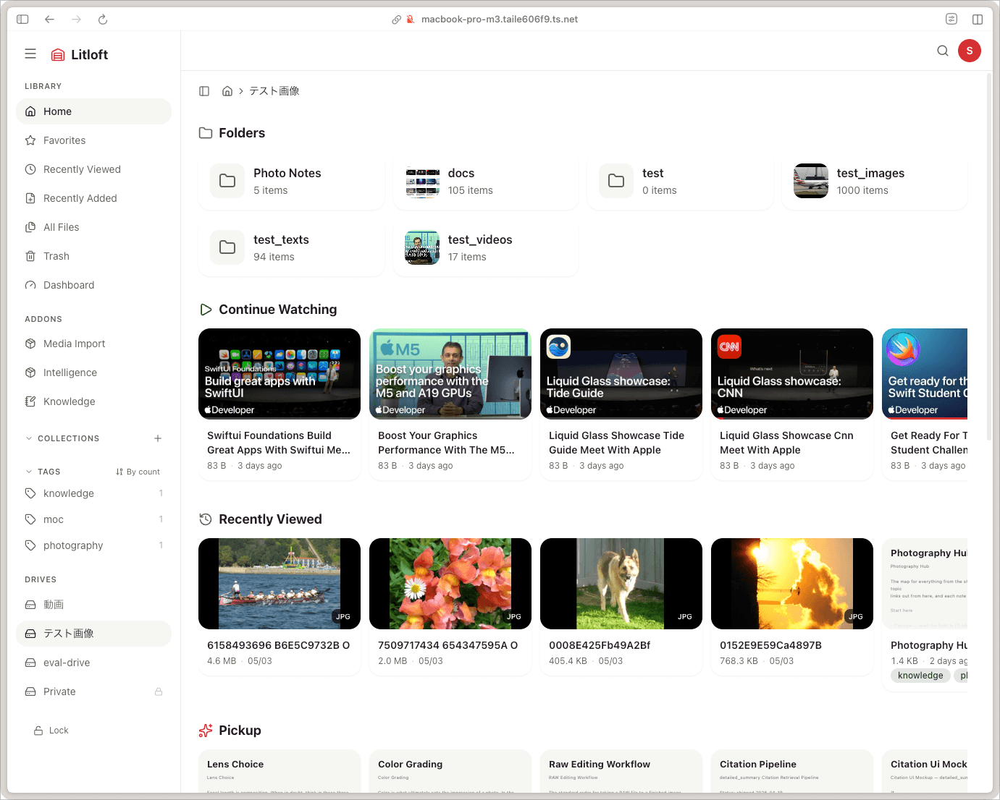
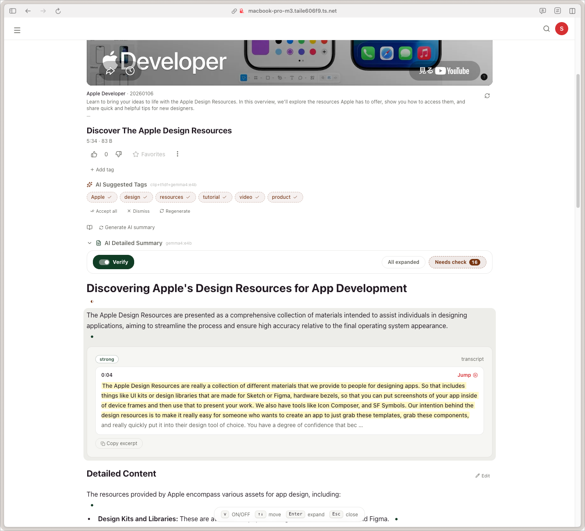

# Litloft

A file-based media library.

Litloft is a self-hosted library app that runs on your home LAN. It gives you a single web interface to manage and share your videos, documents, images, web videos, and Markdown notes.

I originally started building it as a simple video server, but it has evolved to focus heavily on knowledge aggregation and search. By indexing your files in multiple ways, Litloft turns a scattered collection of media into a truly useful, searchable resource.

**[Landing page](https://mamepenguin.github.io/Litloft/)** ·
**[Documentation](docs/README.md)** ·
**[日本語 README](docs/README_ja.md)**

Litloft keeps authentication minimal by design and is meant to be used on a trusted network. If you need to access it outside your LAN, I highly recommend routing it through a VPN like Tailscale.

Personal project. I built this primarily for my own use. Issues and PRs are welcome, but please note that support is on a best-effort basis.

<p align="center">
  
</p>

<p align="center">
  
  
</p>

---

## Why I Built Litloft

There are plenty of great media servers for playback, and excellent note-taking apps for writing. Litloft targets the space in between.

I wanted a single local library to handle lecture recordings, stream archives, PDFs, self-scanned books, personal notes, and all those URLs I bookmarked to "watch later."

I wanted an environment where I could watch a video, search its subtitles, jot down notes, and link them to other documents. When looking back, I wanted to jump straight to the right information—whether starting from a video, a note, or a search query.

## Media Server

At its core, Litloft is a fast, browser-based media server for your LAN.

Point it at a folder, and you can open files directly from your phone, tablet, or PC browser. It supports video resume playback, but also handles images, PDFs, and Markdown files in the same view. You can set access rules per drive, so you don't have to mix family videos with your personal research materials.

Everything is built on top of a solid, everyday library experience: fast browsing, thumbnails, streaming, history tracking, and tagging.

## Search & Summarize (Intelligence)

Litloft indexes the contents of your files so you can pull them up anytime.

By automatically transcribing audio and indexing subtitles/text, you can search for the exact scene where a specific word was spoken. Even with just a vague keyword, you can jump right to the relevant document or video timestamp.

If you connect an LLM, you can also use features like automatic summaries, tag suggestions, and Ask (Q&A). However, AI-generated answers aren't the final destination here. I designed these features to act as practical stepping stones—helping you find the exact file and timestamp so you can check the source yourself.

## Media Import

You can pull external videos (like YouTube) straight into your local library.

Simply paste a URL, or subscribe to channels and playlists to automatically fetch new videos. Litloft grabs the titles, thumbnails, and available subtitles. This means external videos become fully searchable and summarizable, just like your local files.

Instead of letting "Watch Later" links pile up as dead bookmarks, they become an active, searchable part of your archive alongside your own recordings and notes.

## Linking Files and Notes (Knowledge)

Litloft allows you to write Markdown notes linked directly to your media files.

Because notes are saved in ordinary folders, you can edit them in the browser or use your favorite external Markdown editor. You can link a note to a specific timestamp in a video, or connect notes to each other to give your files context.

Rather than just being a standalone notepad, it acts as a space to organize your library—explaining why a video is important, or which document backs up a specific claim.

## What You Can Use It For

- A private media server for videos, books, scans, and personal files.
- A searchable archive for lectures, streams, talks, podcasts, and clips.
- A research library connecting videos, text, screenshots, and notes.
- A place to archive YouTube channels/playlists without losing subtitles or context.
- A local knowledge workspace where notes and summaries live right next to the source files.

## Quick Start

**Requirements:** Git, Docker, Python 3.

```bash
git clone --recurse-submodules https://github.com/mamepenguin/Litloft
cd Litloft
python3 configure.py
docker compose up -d --build
```

Open `http://localhost:3000`.

From another device on the same LAN, open `http://<host-ip>:3000`.

`configure.py` generates your local Docker configuration, drive mounts, ports, and optional add-on services. On the first launch, a setup wizard will guide you through naming drives, access control, and add-on policies.

To update:

```bash
git pull --recurse-submodules
docker compose up -d --build
```

## Feature Sweep

Media: Video streaming, audio playback, Range requests, resume playback, subtitle display, thumbnail previews, image viewer, spread view, Markdown viewer, Mermaid rendering, syntax highlighting, PDF viewer, ZIP/archive browsing.

Library: Multi-drive setup, folder browser, grid/list views, pinned folders, favorites, collections, comments, tags, watch history, recently played, recently added, duplicate detection, smart folders, trash, missing file recovery, upload, folder upload, rename, move, copy, batch operations, in-browser text editing.

Intelligence: Transcript & subtitle indexing, semantic search, scene/frame search, hybrid BM25/vector retrieval, Ask with citations, summaries, detailed Markdown summaries, tag suggestions, retrieval keywords, transcript refinement, vision descriptions, local Whisper, cloud STT providers, Deepgram API, ElevenLabs API, OpenAI-compatible LLM endpoints, Ollama/local LLM support, per-drive privacy policies.

Media Import: URL import, YouTube channel/playlist subscriptions, automatic sync, metadata refresh, caption import, thumbnail caching, provider embeds, import activity log, retry tools, per-drive enablement.

Knowledge: Markdown vaults, frontmatter sync, wiki links, Markdown editing, web clipping, source-file relations, related notes, active summary panel, note distillation, external editor compatibility.

Admin: First-run setup, settings GUI, password-protected drives, access groups, master viewer admin access, add-on policy, restart-pending banner, dashboard, Docker Compose deployment, PWA, dark/light theme.

## Stack

FastAPI, SQLite, SQLAlchemy, Next.js, TypeScript, Tailwind CSS, Docker Compose, ffmpeg, faster-Whisper, SigLIP/CLIP, multilingual embeddings, SQLite FTS5, sqlite-vec.

```
Browser -> :3000 Next.js -> /api/* -> :8000 FastAPI
```

## License

[AGPL-3.0](LICENSE)
