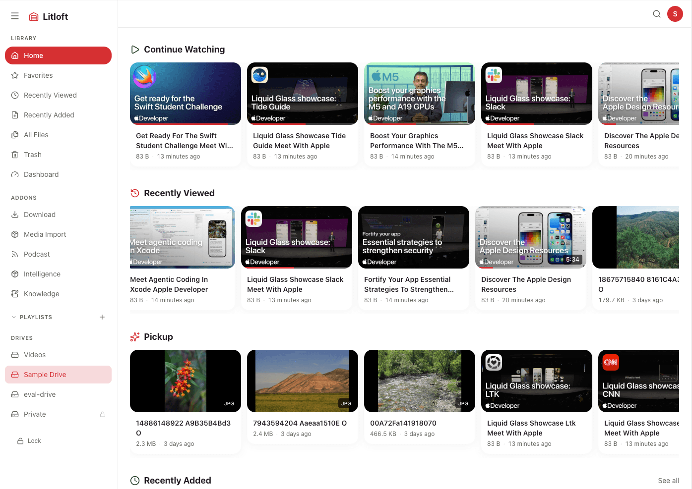
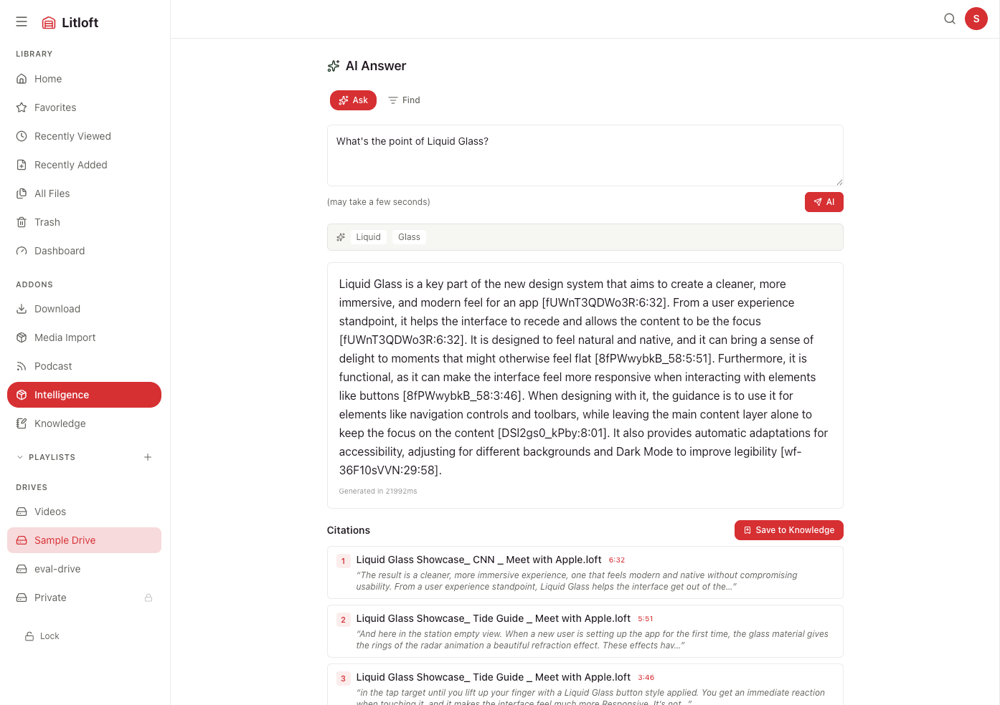

# Litloft

A self-hosted file and media app for your home LAN. Browse, stream, and search your files; optionally use an LLM for tag suggestions, summaries, and natural-language Q&A. Runs on Docker, accessed via browser (PWA).

> **LAN only.** Litloft is designed for trusted home networks. Do not expose it to the public internet without an HTTPS reverse proxy and VPN.

> **Note:** Developed for personal use. Issues and PRs are welcome, but support is best-effort.

**[Landing page](https://mamepenguin.github.io/Litloft/)**

<p align="center">
  
  
</p>

---

## Features

### Core
- **Folder browser** — Navigate nested hierarchies, grid/list view, lazy thumbnail loading
- **Streaming** — Video/audio with Range Request, subtitle display, resume from last position
- **Viewers** — Image viewer (swipe, spread), Markdown (Mermaid, syntax highlight), PDF, Office, ZIP
- **File operations** — Upload (folder, chunked), rename, move, copy, batch operations, in-browser text editing
- **Trash** — Soft delete with 30-day auto-purge; restore at any time
- **Search & discovery** — Keyword search, tag filter, duplicate detection, pinned folders
- **Organization** — Playlists, favorites, per-file comments, watch history with resume

### AI (Intelligence addon)
- **Ask** — Natural language Q&A over your media, with cited source clips
- **Semantic search** — Embedding-based search across transcripts, text, and image frames (CLIP)
- **AI summaries** — Short summary + long-form Markdown with auto-linked citations
- **Auto-tags** — AI-suggested tags with Approve / Dismiss workflow (never applied silently)
- **Transcript refine** — LLM-based ASR correction; originals kept for revert
- **Transcription** — faster-Whisper for local video/audio; YouTube caption import for imported videos

### System
- **Multi-drive** — Separate content areas with independent access control and addon policy
- **Password protection** — Per-drive access groups; master password for admin access
- **Admin UI** — First-run wizard (`/setup`), settings GUI (`/admin/settings`), dashboard
- **Addon system** — In-process and standalone service addons; drive-scoped or global
- **i18n** — Japanese / English (cookie-based, no URL prefix)
- **Dark / light theme**, **PWA** (add to home screen)

---

## Quick Start

**Prerequisites:** Git · Docker · Python 3

### 1. Clone

```bash
git clone --recurse-submodules https://github.com/mamepenguin/Litloft
cd Litloft
```

### 2. Configure

```bash
python3 configure.py
```

The interactive wizard generates all config files. It asks:

| Step | What it configures |
|------|--------------------|
| ① Drives | How many drives, display name, host path for each |
| ② Port | Default `3000`; change if needed |
| ③ Password protection | Per-drive access groups and passwords (optional) |
| ④ Intelligence addon | Whisper model, embedding model, LLM provider, AI features (optional) |
| ⑤ Knowledge addon | Markdown vault (optional) |

**Output files:** `docker-compose.override.yml`, `drives.json`, `passwords.json`, `addons/intelligence/search-config.yml`, `.env`

> Re-run `configure.py` any time to update settings. The generated files are plain text and can also be edited by hand.

> **`drives.json` must exist before the first start** — `docker-compose.yml` always bind-mounts it. Running `configure.py` (recommended) creates it automatically. If you prefer to set things up manually instead, see the note below step 3.

### 3. Start

```bash
docker compose up -d --build
```

Open `http://localhost:3000`. From other devices on your LAN: `http://<host-ip>:3000`.

> First build downloads base images + AI models. Expect a few minutes.

> **Manual setup (without configure.py):** Create drive volume mounts by hand — copy `docker-compose.override.yml.example` to `docker-compose.override.yml` and edit the host paths. Then create a minimal `drives.json` so Docker can start: `echo '[]' > drives.json`. After that, `docker compose up -d --build` will open the first-run wizard at `/setup`, which writes the final `drives.json` and `passwords.json`. Once the wizard completes, restart to apply: `docker compose restart`.

---

## AI Features (Intelligence Addon)

The Intelligence addon adds semantic search, Ask Q&A, and AI summaries. It requires more resources than the base app.

### Hardware

| Whisper model | RAM (approx.) | Notes |
|---------------|--------------|-------|
| small | ~500 MB | Fast, lower accuracy |
| turbo *(default)* | ~1.2 GB | Best accuracy/speed balance |
| large-v3 | ~3 GB | Highest accuracy |

Indexing (transcription + embedding) is CPU-intensive and runs in the background after files are scanned.

### LLM (required for Ask, summaries, auto-tags)

Choose one option in `configure.py`:

**Option A — Local (recommended for privacy)**

Install [Ollama](https://ollama.com) on your host and pull a model:

```bash
ollama pull gemma3:4b   # or llama3.2, qwen2.5, etc.
```

`configure.py` points Litloft at `http://host.docker.internal:11434` automatically. Your data never leaves your machine.

**Option B — API**

Use OpenAI, DeepSeek, or any OpenAI-compatible endpoint. Enter your base URL and API key when prompted. File content (transcripts, text) is sent to the API during indexing and Ask queries.

> Semantic search and transcription work without an LLM — only the text-generation features require one.

### Cloud transcription providers (cloud STT)

In addition to local Whisper (`faster-whisper`, CPU), Litloft supports several cloud STT providers:

| Provider | Strengths | Notes |
|---|---|---|
| OpenAI-compatible (Groq / Fireworks / etc) | OSS Whisper lineage, familiar API | The official OpenAI API enforces a 25 MB per-file limit |
| Deepgram Nova-3 | Top-class WER, strong diarization | Separate billing |
| ElevenLabs Scribe | Diarization, long-form audio | Separate billing |

Configure via the `transcription` section in `addons/intelligence/search-config.yml` plus the relevant API key env (`DEEPGRAM_API_KEY` / `ELEVENLABS_API_KEY` / `OPENAI_API_KEY`). See [docs/PROVIDERS.md](docs/PROVIDERS.md) for the full matrix.

**Privacy note:** selecting a cloud provider sends audio bytes to that provider. Privacy-sensitive drives can pin **forced local fallback** by setting `addons.intelligence.transcription_cloud: false` in `drives.json` for that drive — even when the global provider is a cloud one.

---

## Addons

Addons are cloned alongside the main repo via `--recurse-submodules`. Enable them in `configure.py`.

| Addon | Description |
|-------|-------------|
| **intelligence** | AI search, Ask Q&A, summaries, auto-tags, CLIP image search |
| **knowledge** | Per-drive Markdown vault and web clipping |
| **cloud-sync** | Backup drives to cloud storage via rclone (S3, Backblaze, Google Drive, …) |
| **media_import** | Import media from URLs as `.loft` references with metadata and provider embeds |

---

## Access Control

Without `passwords.json`, all drives are publicly accessible on your LAN.

With `passwords.json`, each drive with an `access_group` requires a password to unlock. Drives without a group are accessible to anyone. The viewer who unlocks with the master password (a password that covers all groups) becomes the **admin**.

Unlock URL: `http://<ip>:3000/unlock` (intentionally not linked in the UI)

---

## Updating

```bash
git pull --recurse-submodules
docker compose up -d --build
```

If the build fails, the previous containers remain running.

---

## Development

```bash
# Backend tests (inside Docker)
docker build -f backend/Dockerfile.test -t litloft-test backend/
docker run --rm litloft-test

# Frontend tests
cd frontend && pnpm test

# Logs
docker compose logs -f backend
```

---

## Tech Stack

| Layer | Technology |
|-------|-----------|
| Backend | FastAPI (Python 3.12) + SQLite (SQLAlchemy) + ffmpeg |
| Frontend | Next.js 16 (App Router, TypeScript, Tailwind CSS v4) |
| Infrastructure | Docker Compose |
| AI | faster-Whisper · SigLIP2/CLIP · multilingual-e5 / Ruri · sqlite-vec · SQLite FTS5 |

```
Browser → :3000 (Next.js) → rewrites /api/* → :8000 (FastAPI, internal only)
```

---

## License

[AGPL-3.0](LICENSE)
