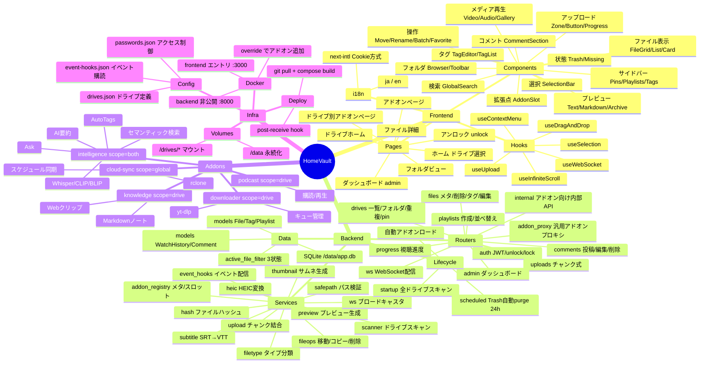
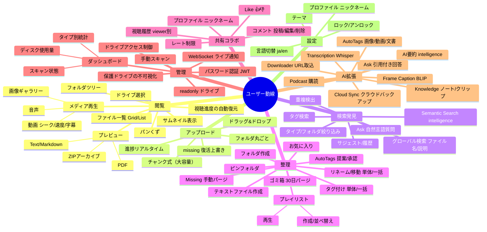
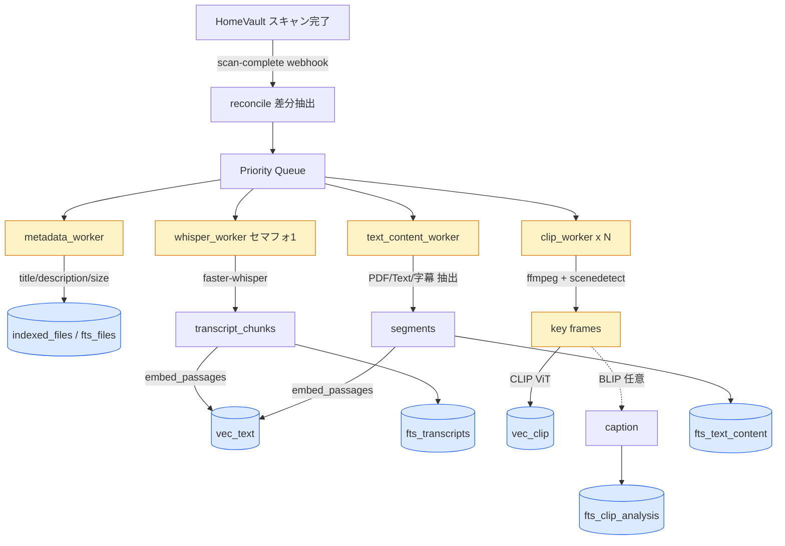
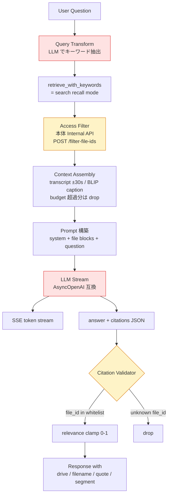

# HomeVault 機能マップ

全体像を俯瞰し、拡張・整理の判断に使うためのマインドマップ。
Mermaid 形式なので、MarkdownPreview でそのまま閲覧できる。

粒度は「ユーザーが認知できる機能」「開発者がディレクトリ単位で認識するモジュール」レベル。
内部実装の細部（関数名など）は含めない。

---

## 1. レイヤー軸マップ

実装構造に沿った配置。拡張時に「どこを触るか」を素早く特定するための地図。

---

## 2. ユーザー動線軸マップ

「ユーザーが何をしたいか」に沿った配置。機能の重複・抜けを発見したり、
同じ動線に関わる複数モジュールを束ねて見直すのに使う。

---

## 3. Intelligence アドオン 検索の仕組み

`intelligence` アドオンは HomeVault の AI 軸の中核。5 チャネル並列検索とスコア融合、
Ask による引用付き回答を提供する。

### 3-1. インデックス時の流れ

ファイルが HomeVault にスキャンされると、webhook 経由で intelligence にタスクが流れ、
優先度付きキュー＋種別ごとのワーカーで処理される。

**関連ファイル**: `addons/intelligence/app/indexer.py`, `workers/whisper.py`, `workers/clip.py`, `workers/metadata.py`, `database.py`

### 3-2. 検索時の流れ（/search）

クエリを 2 種類のベクトル化＋3 種類の FTS で並列検索し、モード別にスコア融合する。

**関連ファイル**: `addons/intelligence/app/search.py`, `embedder.py`

### 3-3. Ask の流れ（/ask）

`/search` の recall モードを内部で使い、LLM で引用付き回答を生成。
citation は必ずホワイトリスト検証でハルシネーションを防ぐ。

**セキュリティ 2 層**:
1. 内部フィルタ: `access_token` cookie → 本体 `/api/internal/filter-file-ids` で権限チェック
2. citation 検証: LLM が捏造した file_id は retriever 結果セットに無ければ drop

**関連ファイル**: `addons/intelligence/app/rag/service.py`, `retriever.py`, `query_transform.py`, `parser.py`, `context.py`, `prompt.py`

### 3-4. 使われている構成要素まとめ

| 種別 | 採用技術 | 用途 |
|---|---|---|
| テキスト埋め込み | multilingual-e5 / Ruri | クエリ・文書の共通ベクトル空間 |
| 画像埋め込み | CLIP ViT (OpenAI / llm-jp) | 画像・動画フレームの検索 |
| 画像記述 (任意) | BLIP | auto-tags 精度向上、Ask コンテキスト |
| 音声書き起こし | faster-whisper (CTranslate2) | transcript + タイムスタンプ |
| フレーム抽出 | ffmpeg + scenedetect | 代表フレーム選択 |
| ベクトル検索 | sqlite-vec (L2 距離) | 低依存で同プロセス |
| 全文検索 | SQLite FTS5 | metadata / transcript / text_content |
| スコア融合 | Weighted RRF / Cosine 合成 | recall / precision モード |
| LLM | OpenAI 互換 API (ollama / vLLM / OpenAI / DeepSeek) | Ask 回答・クエリ変換 |
| 権限境界 | 本体 Internal API + addon_proxy | 二重のアクセス制御 |

---

## 使い方

- **新機能追加の設計時**: 動線軸で似た機能がないか確認 → レイヤー軸でどのモジュールを触るか特定
- **リファクタリング時**: レイヤー軸で肥大化したノードを探し、分割候補を議論
- **アドオン設計時**: 動線軸の AI拡張 / 検索発見 に既存アドオンとの重複がないか確認
- **ドキュメント更新時**: 新機能をここに 1 行追加 → `docs/FEATURES.md` 本文も更新

メンテのヒント: 機能を足したら葉を 1 つ追加するだけでよい。構造（ブランチ）は滅多に変えない。
