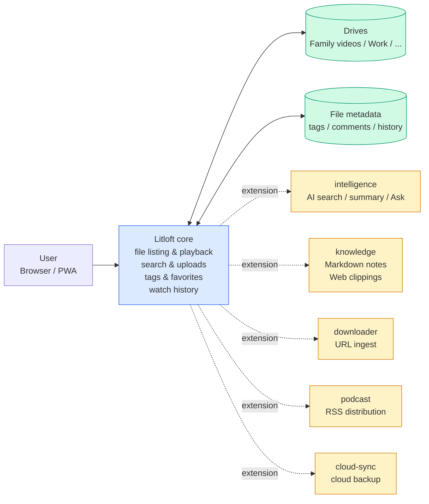
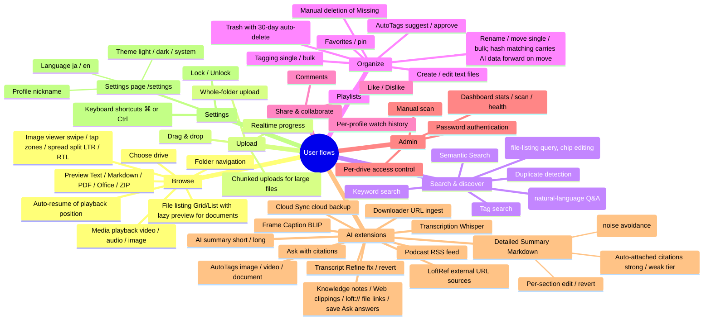
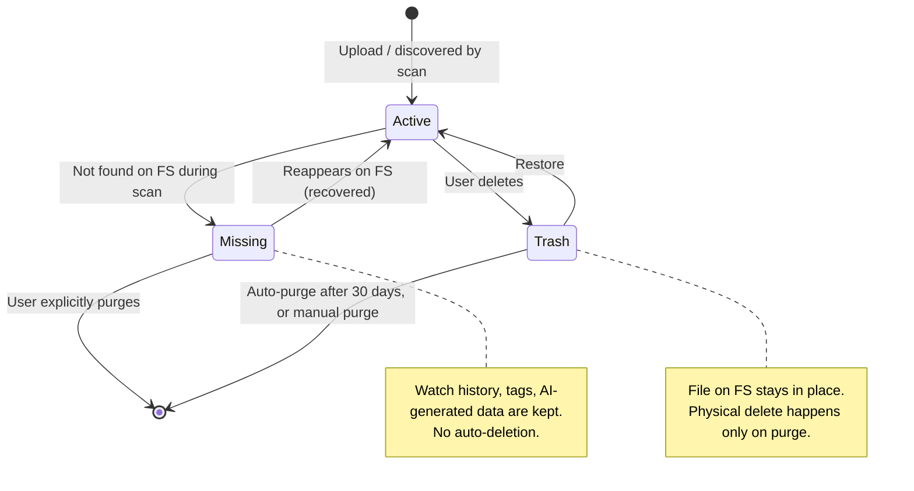
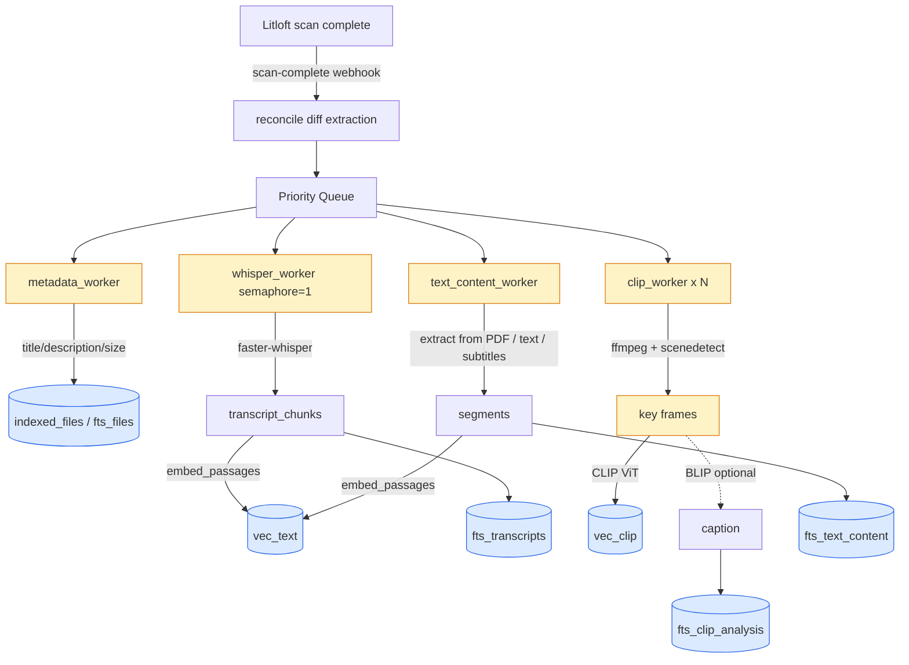
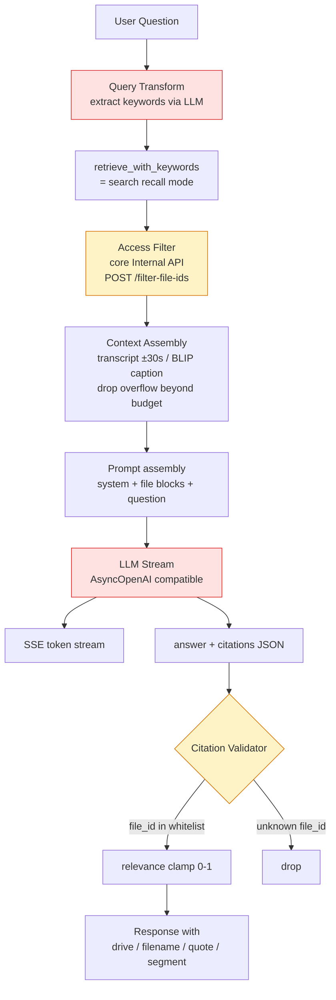

# Litloft feature map

A bird's-eye view of "what this system can do".
Internal implementation details (file names, function names, module names, etc.) are out of scope.

---

## 1. Big picture

Behind a single browser-facing entry point sit the core and a set of addons.
The core handles file management, playback, and basic search. AI, notes, sync, and other extra features
are plugged in as independent addons.

- **Drive**: the unit of content. Each drive is fully independent — access control and the AI on/off state are configured per drive.
- **Addon**: an independent module that extends the core. Right after cloning, every addon is disabled; you opt in to the ones you need. Whether to use AI features is a per-drive choice.

---

## 2. User-flow axis map

A mind map laid out along "what the user wants to do".
Use it to spot missing or duplicated features.

---

## 3. File-state model

A file is shaped by both the FS and user actions, so it has three states.
AI-generated data (transcripts, embedding vectors, captions) cannot be regenerated from the FS,
so even when a file temporarily disappears from the FS the system does not delete immediately.

---

## 4. Intelligence addon — how search works

Below is the engineer-facing detail. The `intelligence` addon is the heart of Litloft's AI axis,
providing a 5-channel parallel search with score fusion and Ask-style answers with citations.
The diagrams below describe the internal flow and the technologies used, for outside engineers and onboarding.

### 4-1. Indexing flow

When a file is scanned by Litloft, a webhook drops a task into intelligence,
which is processed by a priority queue plus per-kind workers.

**Related files**: `addons/intelligence/app/indexer.py`, `workers/whisper.py`, `workers/clip.py`, `workers/metadata.py`, `database.py`

### 4-2. Search flow (/search)

A query is vectorized two ways and run through three FTS indexes in parallel; scores are fused per mode.

**Related files**: `addons/intelligence/app/search.py`, `embedder.py`

### 4-3. Ask / Find flow (/ask, /find)

Both reuse `/search` recall mode internally and share the Stage A-D pipeline (query decompose → personal history filter → category expand → scoped retrieve), with two output paths:

- **E_ask (`POST /ask`)**: feeds the Stage A-D retrieve into the LLM and streams an answer with citations (existing).
- **E_find (`POST /find`)**: returns the Stage A-D retrieve as a file-card list plus transparent chips (no LLM text generation, no SSE; a single JSON response).

Find mode handles file-listing intent ("Which of the movies I watched last week were sci-fi?") by returning a ranked file list rather than an Ask-style narrative answer. The LLM's interpretation is exposed to the user as chips; clicking × on a chip relaxes that one axis and re-retrieves (stateless — just re-POST with `overrides`). See spec [`2026-04-30-intelligence-find-mode.md`](superpowers/specs/2026-04-30-intelligence-find-mode.md) for details.

The sequence below is for Ask (E_ask). Find replaces everything from "LLM Stream" onward with "format the retrieve result as JSON and return"; citation validation does not run (the tier-1 retrieve hit chunk is shown directly).

Citations always go through whitelist validation to block hallucinations.

**Two layers of safety**:
1. Internal filter: `access_token` cookie → permission check via the core's `/api/internal/filter-file-ids`.
2. Citation validation: any LLM-fabricated file_id absent from the retriever's result set is dropped.

**Related files**: `addons/intelligence/app/rag/service.py` (`stream_answer` for Ask, `find_files` for Find), `addons/intelligence/app/routers/rag.py` (`/ask`, `/find`), `retriever.py`, `query_transform.py`, `query_decomposer.py`, `category_expander.py`, `history_client.py`, `parser.py`, `context.py`, `prompt.py`. Frontend: `addons/intelligence/frontend/pages/find.tsx`, `FindModeSlot.tsx`, `FindChip.tsx`, `api.ts`

### 4-4. Building blocks

| Kind | Tech | Purpose |
|---|---|---|
| Text embedding | multilingual-e5 / Ruri | Shared vector space for queries and documents |
| Image embedding | CLIP ViT (OpenAI / llm-jp) | Search over images and video frames |
| Image description (optional) | BLIP | Improves auto-tag accuracy, augments Ask context |
| Speech transcription | faster-whisper (CTranslate2) | Transcript with timestamps |
| Frame extraction | ffmpeg + scenedetect | Picks representative frames |
| Vector search | sqlite-vec (L2 distance) | In-process, low-dependency |
| Full-text search | SQLite FTS5 | metadata / transcript / text_content |
| Score fusion | Weighted RRF / cosine fusion | recall / precision modes |
| LLM | OpenAI-compatible API (ollama / vLLM / OpenAI / DeepSeek) | Ask answers, query transform |
| Permission boundary | Core Internal API + addon_proxy | Two-layer access control |

---

## How to use this document

- **Want to know what this system can do**: sections 1 and 2 are enough.
- **Want to understand AI search (engineers, onboarding)**: see section 4.
- **Adding a new feature**: check section 2 (the user-flow axis) for overlap with what already exists; if there's no overlap, add a single leaf.

Maintenance tip: the structure (the branches) rarely changes. When you add a feature, just append one leaf.
Implementation details belong in `docs/FEATURES.md` / `docs/ADDON-DEVELOPMENT.md`.
