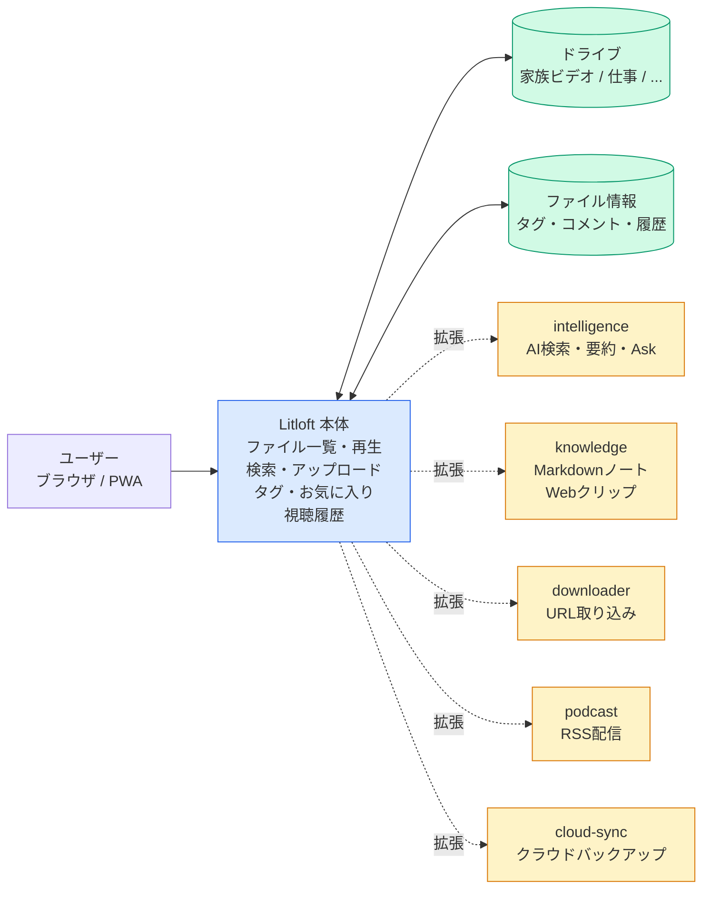
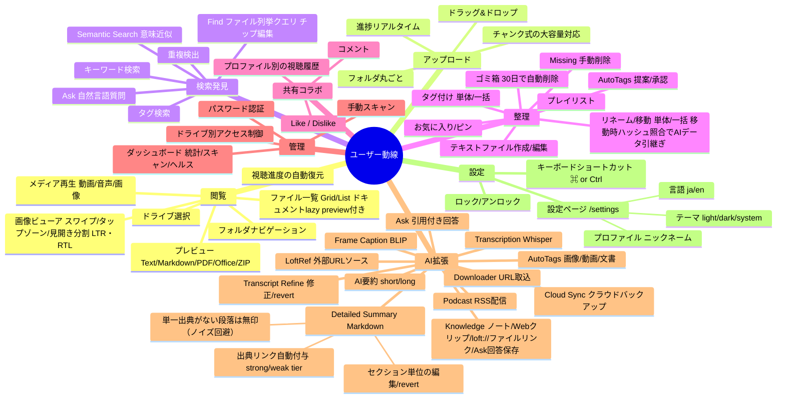
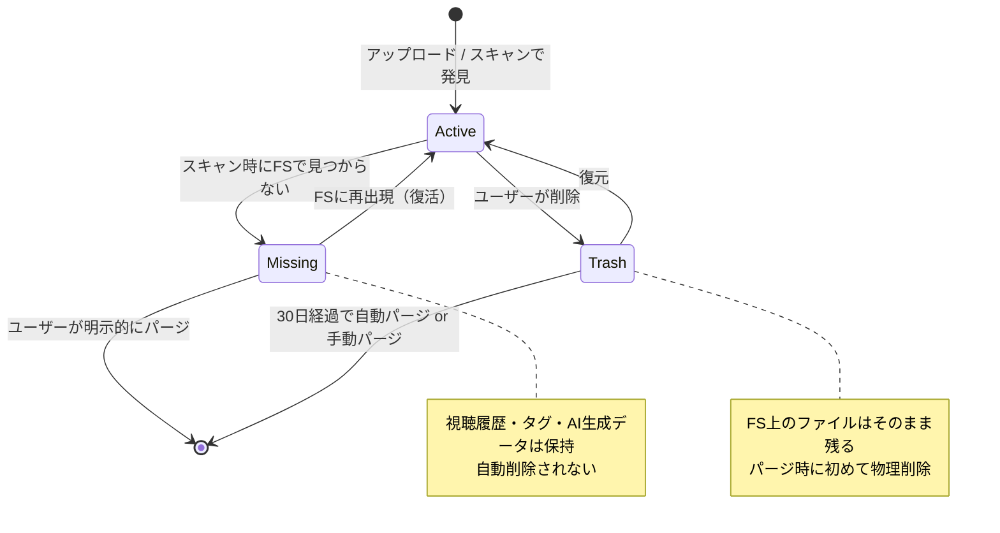
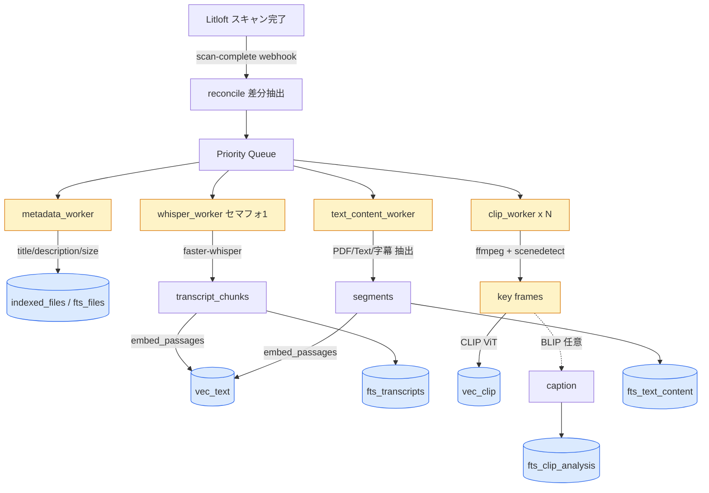
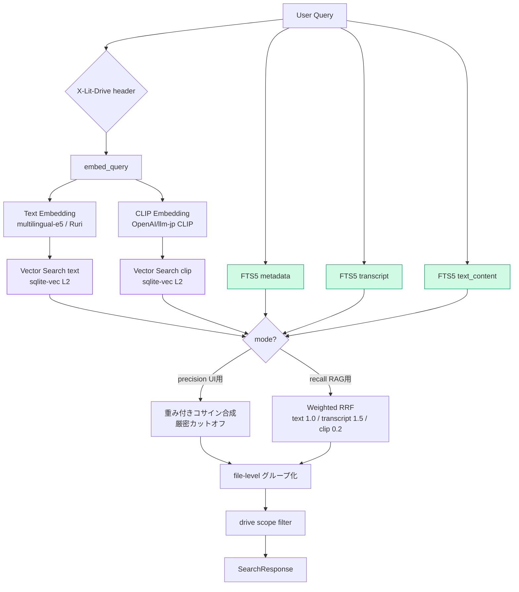
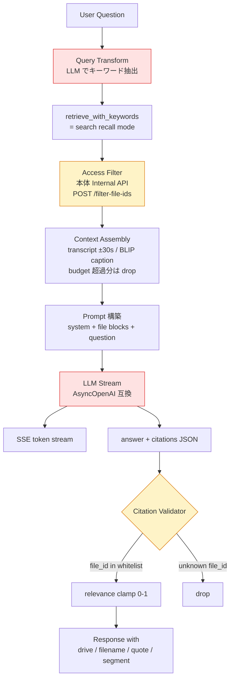

# Litloft 機能マップ

「このシステムに何ができるか」を俯瞰するための資料。
内部実装の詳細（ファイル名・関数名・モジュール名など）は含めない。

---

## 1. 全体構成

ブラウザからアクセスする単一のエントリーポイントの背後に本体とアドオン群が並ぶ。
本体はファイル管理・再生・基本検索を担当し、AI・ノート・同期などの付加機能は
アドオンとして独立して差し込む構造になっている。

- **ドライブ**: コンテンツ領域の単位。各ドライブは完全に独立しており、アクセス制御・AI機能の有効/無効もドライブごとに設定する。
- **アドオン**: 本体を拡張する独立モジュール。クローン直後の状態ではすべて無効で、必要なものだけを追加する。AI機能を使うかどうかはドライブごとに選べる。

---

## 2. ユーザー動線軸マップ

「ユーザーが何をしたいか」に沿って機能を並べたマインドマップ。
機能の抜け・重複を見るのに使う。

---

## 3. ファイル状態モデル

ファイルは FS とユーザー操作の両方に影響を受けるため、3 つの状態を持つ。
AI 生成データ（書き起こし・埋め込みベクトル・キャプション）は FS から再生成できないので、
FS で一時的に見えなくなっても即削除しない設計になっている。

---

## 4. Intelligence アドオン 検索の仕組み

以降は技術者向けの詳細。`intelligence` アドオンは Litloft の AI 軸の中核で、
5 チャネル並列検索とスコア融合、Ask による引用付き回答を提供する。
外部の技術者やオンボーディング向けに、採用技術と内部フローを示す。

### 4-1. インデックス時の流れ

ファイルが Litloft にスキャンされると、webhook 経由で intelligence にタスクが流れ、
優先度付きキュー＋種別ごとのワーカーで処理される。

**関連ファイル**: `addons/intelligence/app/indexer.py`, `workers/whisper.py`, `workers/clip.py`, `workers/metadata.py`, `database.py`

### 4-2. 検索時の流れ（/search）

クエリを 2 種類のベクトル化＋3 種類の FTS で並列検索し、モード別にスコア融合する。

**関連ファイル**: `addons/intelligence/app/search.py`, `embedder.py`

### 4-3. Ask / Find の流れ（/ask, /find）

`/search` の recall モードを内部で使い、Stage A-D（query decompose → personal history filter → category expand → scoped retrieve）を共通基盤として 2 系統の出力経路を持つ。

- **E_ask (`POST /ask`)**: Stage A-D の retrieve 結果を LLM に流し、引用付き文章をストリーム返却（既存）
- **E_find (`POST /find`)**: Stage A-D の retrieve 結果をそのままファイルカード列 + 透明化チップとして返却（LLM 文章生成なし、SSE なし、単発 JSON）

Find モードは「先週観た映画で SF っぽいのどれ？」のようなファイル列挙意図のクエリを Ask の文章回答ではなくランク付きファイルリストで返す。LLM 解釈はチップとしてユーザーに見せ、× クリックで個別軸を緩めて再 retrieve できる（ステートレス、`overrides` を再 POST するだけ）。詳細は spec [`2026-04-30-intelligence-find-mode.md`](superpowers/specs/2026-04-30-intelligence-find-mode.md)。

以下は Ask（E_ask）のシーケンス。Find は最後の LLM Stream 以降を「retrieve 結果を JSON 整形して返却」に置き換えるだけで、citation 検証は走らない（tier 1 の retrieve hit chunk をそのまま見せる）。

citation は必ずホワイトリスト検証でハルシネーションを防ぐ。

**セキュリティ 2 層**:
1. 内部フィルタ: `access_token` cookie → 本体 `/api/internal/filter-file-ids` で権限チェック
2. citation 検証: LLM が捏造した file_id は retriever 結果セットに無ければ drop

**関連ファイル**: `addons/intelligence/app/rag/service.py` (`stream_answer` for Ask, `find_files` for Find), `addons/intelligence/app/routers/rag.py` (`/ask`, `/find`), `retriever.py`, `query_transform.py`, `query_decomposer.py`, `category_expander.py`, `history_client.py`, `parser.py`, `context.py`, `prompt.py`. Frontend: `addons/intelligence/frontend/pages/find.tsx`, `FindModeSlot.tsx`, `FindChip.tsx`, `api.ts`

### 4-4. 使われている構成要素まとめ

| 種別 | 採用技術 | 用途 |
|---|---|---|
| テキスト埋め込み | multilingual-e5 / Ruri | クエリ・文書の共通ベクトル空間 |
| 画像埋め込み | CLIP ViT (OpenAI / llm-jp) | 画像・動画フレームの検索 |
| 画像記述 (任意) | BLIP | auto-tags 精度向上、Ask コンテキスト |
| 音声書き起こし | faster-whisper (CTranslate2) | transcript + タイムスタンプ |
| フレーム抽出 | ffmpeg + scenedetect | 代表フレーム選択 |
| ベクトル検索 | sqlite-vec (L2 距離) | 低依存で同プロセス |
| 全文検索 | SQLite FTS5 | metadata / transcript / text_content |
| スコア融合 | Weighted RRF / Cosine 合成 | recall / precision モード |
| LLM | OpenAI 互換 API (ollama / vLLM / OpenAI / DeepSeek) | Ask 回答・クエリ変換 |
| 権限境界 | 本体 Internal API + addon_proxy | 二重のアクセス制御 |

---

## 使い方

- **このシステムで何ができるか知りたい**: セクション 1・2 を見れば十分。
- **AI 検索の仕組みを知りたい（技術者・オンボーディング）**: セクション 4 を参照。
- **新機能追加時**: セクション 2（動線軸）に既存と重複がないか確認し、あれば葉を 1 つ追加する。

メンテのヒント: 構造（ブランチ）は滅多に変えない。機能を足したら葉を 1 つ追加するだけでよい。
実装詳細は `docs/FEATURES.md` / `docs/ADDON-DEVELOPMENT.md` の側に置く。
