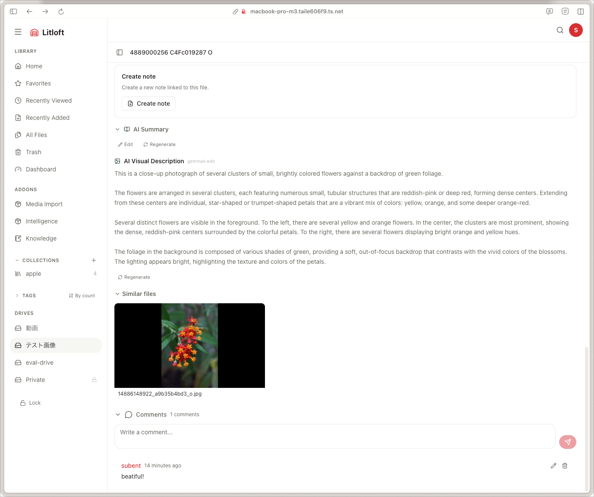

# Comments and watch history

Two features that build on the **viewer** concept — a per-device identity stored in a cookie.

## Viewer identity in 30 seconds

- A *viewer* is whoever is using a particular browser profile on a particular device.
- They pick a nickname (max 50 chars). It is hashed to a 16-character `viewer_id` (`SHA256(nickname)[:16]`).
- The cookie is `lit_viewer` (sometimes referred to as `hv_viewer`).
- There is **no account system**. The cookie is the identity. Clearing it == becoming a new viewer.
- When no nickname is set, Litloft falls back to local-only behaviour: watch progress and likes still work but are not synced to the server (return `204 No Content`).

This model is intentional: trusted home networks, personal use. Privacy-by-default, multi-device by accident only.

## Comments

Each file has a comment thread.

- Posting requires only a nickname (no password). The viewer ID is recorded.
- Markdown is **not** rendered; comments are plain text.
- Threading is one level deep (top-level comments only).

### Rate limits and caps

To stop accidents:

- **10 comments per 60 seconds per IP**, server-enforced.
- **500 comments per file**, after which posting returns an error.

### Editing and deletion

- A viewer can edit or delete only their own comments (matched by viewer ID, which is in the cookie).
- A master viewer (admin) can delete any comment.

### Where comments appear

- File detail page, below the player and tags.
- A drive-wide *Recent comments* widget on the admin dashboard (when implemented).

## Watch history

`WatchHistory` is a single table that does double duty: **view history** (file detail page opens) and **playback progress** (player position/duration).

### When the row is updated

- **On opening the file detail page** — a `POST /api/files/{file_id}/progress` with an empty body updates `last_played_at`. This applies to every media type, including text, Markdown, image, PDF.
- **For media files only** — once the player starts, position and duration are POSTed every 5 seconds and on `pause` / `seek` / `ended`.

Both paths refresh `last_played_at`. A view-only POST never overwrites the playback markers of a media file (you can open a video page after a partial watch and not lose your resume position).

### Continue-watching gate

The drive home page surfaces a *Continue watching* row. The query selects rows where:

- `playback_position > 0` and `duration > 0` (so view-only opens are filtered).
- `playback_position / duration` is below 90% (so finished items are filtered).

The 90% gate is in `backend/app/routers/drives.py`.

### Personal vs shared

`WatchHistory` is **per viewer × file**. Multiple devices on the same nickname are reconciled server-side (the `viewer_id` is the hash, identical across devices that pick the same nickname).

If two devices have different nicknames they are different viewers — your phone and your laptop will each track progress independently.

### Privacy

- There is no admin-facing "viewer history list" by design.
- Personal history is queryable only by the viewer themselves (`/api/profile/history`).
- The intelligence addon's *personal_history* feature reads from this table, scoped to the requesting viewer's ID.

## Profile

The profile page (`/app/settings`) lets a viewer set:

- Their nickname (writes the `lit_viewer` cookie and rebuilds the viewer ID).
- Theme preference (light, dark, system).
- Language (Japanese, English).
- Per-device toggles like *autoplay* (stored in localStorage rather than the DB).

There is no account password and no email. The profile is purely local-meets-cookie.

## Resetting a viewer

- **Forget identity**: clear the `lit_viewer` cookie. New nickname creates a new viewer.
- **Forget watch progress**: from the profile page, *Clear watch history*. (Or from the API: `DELETE /api/profile/history`.)
- **Forget comments**: edit or delete each one yourself, or ask an admin.

## Master viewer comment moderation

A master viewer can:

- Delete any comment.
- Bulk-clear comments on a file (no UI yet; via API).

There is no flagging / reporting workflow because Litloft is not a multi-tenant public service.
