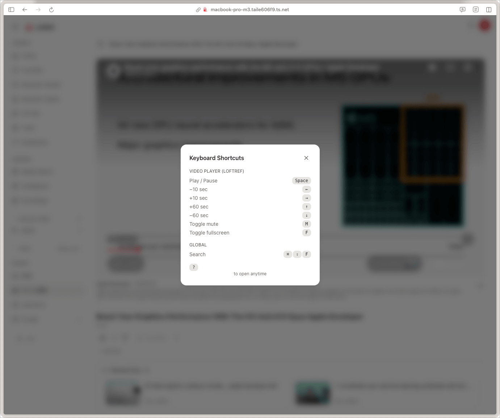

# Keyboard shortcuts and gestures

Single-character shortcuts only fire when no input is focused. Chords that are
meant to work while you type (the Markdown editor's formatting keys, the search
modal's own close chord) are the documented exceptions.

## The primary modifier

Shortcuts are written here as `Cmd/Ctrl`, and the hardware key depends on the
platform:

- **macOS** — the primary modifier is **Cmd**. Holding the literal Control key
  does *not* fire these shortcuts; that is deliberate, so Litloft does not
  shadow the emacs-style cursor chords macOS applications are expected to
  leave alone.
- **Windows / Linux** — the primary modifier is **Ctrl**. The Win/Super key is
  reserved by the OS and does not fire them.

## Global

These are available on every page.

| Key | Action |
|---|---|
| `?` | Open the shortcut cheat sheet for the current page |
| `Esc` | Close the topmost modal / dialog |
| `Cmd/Ctrl+K` | Open the drive-wide file switcher |
| `Cmd/Ctrl+Shift+F` | Open search |
| `N` | Open Quick Note (see [Quick Note](quick-note.md)) |

`Cmd/Ctrl+K` and `Cmd/Ctrl+Shift+F` open the same modal — the first lands on
recently opened files, the second on search. While the modal is open, either
chord closes it again.

### Quick Note panel

| Key | Action |
|---|---|
| `Cmd/Ctrl+Enter` | Save the note |
| `Esc` | Close the panel (asks first if the note has unsaved text) |

Both fire while the note textarea has focus.

## File browsing

These fire on `/drive/<name>` and `/drive/<name>/<path>` pages.

| Key | Action |
|---|---|
| `Cmd/Ctrl+C` | Copy the selected files |
| `Cmd/Ctrl+X` | Cut the selected files |
| `Cmd/Ctrl+V` | Paste into the current folder |
| `Cmd/Ctrl+N` | Create an empty `untitled-{timestamp}.md` in the current folder and open it in the editor (see [Browsing files → Creating a new file](file-browsing.md#creating-a-new-file)) |

`Cmd/Ctrl+N` needs a concrete destination folder, so it is a no-op in search
results and in the flat virtual views (favourites, smart folders). A tag filter
applied *inside* a folder does have one, and creates into that folder.

Copy / cut / paste act on the current selection, which is empty until you turn
selection on, so they are no-ops until then.

## Renaming

| Key | Action |
|---|---|
| `F2` | Rename the focused item, in place |

What `F2` reaches depends on where the focus is:

| Focus | Renames |
|---|---|
| A row in the folder tree | That row — **folder or file** |
| A folder card in the grid | That folder |
| A file card in the grid | Nothing; use the context menu, which opens the rename dialog |

`F2` only fires while a row or card actually holds focus. Renaming happens
inline — no dialog — with the base name preselected so the extension is not
overwritten. `Enter` commits, `Esc` cancels.

## Video and audio player

The same bindings apply to Litloft's own player and to the `.loft` player
supplied by the Media Import addon.

| Key | Action |
|---|---|
| `Space` | Play / pause |
| `←` | Seek −10 s |
| `→` | Seek +10 s |
| `↑` | Seek +60 s |
| `↓` | Seek −60 s |
| `M` | Toggle mute |
| `F` | Toggle fullscreen |

OS media keys (play/pause, next, previous) are wired through the Media Session
API.

## File navigation (non-media files)

| Key | Action |
|---|---|
| `←` | Previous file in the current folder |
| `→` | Next file in the current folder |

These bindings are not active on video / audio pages — there `←` and `→` are
seek controls.

## Image gallery and archive page-turner

| Key | Action |
|---|---|
| `←` / `→` | Previous / next image (reading-direction aware) |
| `Space` | Start / stop the slideshow |
| `Esc` | Close the viewer |

| Gesture | Action |
|---|---|
| Swipe right / left | Next / previous page (50 px threshold) |
| Tap left edge / right edge | Previous / next page |
| Tap centre | Toggle the controls overlay |

There is no pinch-zoom and no panning in either image viewer.

RTL (right-to-left) mirroring is partial, and deliberately so: the **arrow keys
and the edge taps** mirror, following the reading direction. The **swipe does
not** — a swipe to the right is always "next page", because the swipe follows
the hand, not the text.

## File detail

| Key | Action |
|---|---|
| `Cmd/Ctrl+\` | Show / hide the inspector panel |

On every page that has an inspector: Markdown notes, HTML previews, media,
PDFs, archives and images. A file whose type Litloft does not recognise — and
plain text, subtitles and the Office formats, which have no viewer to give a
column to — keeps the older stacked page and has no inspector. Desktop only: on
a phone the inspector is a bottom sheet that rests rather than closes, and the
toggle in the page row raises it. This chord fires even while a note's editor
has focus.

### Markdown editor (Knowledge addon)

Available while editing a note. All of these fire with the editor focused.

| Key | Action |
|---|---|
| `Cmd/Ctrl+S` | Keep this version (see [version history](../addons/knowledge.md)) |
| `Cmd/Ctrl+B` | Bold |
| `Cmd/Ctrl+I` | Italic |
| `Cmd/Ctrl+K` | Insert link |
| `Cmd/Ctrl+E` | Inline code |
| `Cmd/Ctrl+Shift+K` | Code block |
| `Cmd/Ctrl+Shift+\` | Cycle edit / split / preview |

`Cmd/Ctrl+S` does not save in the usual sense — the note is already saved
automatically. It marks the current text as a version worth keeping, so it
survives the pruning that applies to automatic snapshots.

`Cmd/Ctrl+K` is bound twice on purpose: with the editor focused it inserts a
link, and everywhere else it opens the file switcher.

## Modals

Modal-specific shortcuts can be discovered with `?` while the modal is open.
Common ones:

| Key | Action |
|---|---|
| `Esc` | Cancel / close |
| `Enter` | Confirm primary action |
| `Tab` / `Shift+Tab` | Move focus |

## Mouse shortcuts

| Action | Result |
|---|---|
| Right-click on a file or folder | Context menu (rename, move, copy, delete, pin, etc.) |
| Long-press (touch) | Same as right-click |
| Click + Shift on a file | Range selection in the grid |
| Click + `Cmd`/`Ctrl` on a file | Toggle individual selection |
| Drag a file onto a folder | Move it there |
| Hold a drag over a collapsed tree folder | Expands it after 600 ms, so you can drop into a folder you have not opened yet |

## Player-specific gestures (video)

Touch and mouse have separate, non-overlapping gesture sets — the player picks
one from the pointer type, so neither can fire the other's actions.

**Touch**

| Gesture | Action |
|---|---|
| Tap | Show / hide the controls |
| Double-tap the left or right half | Skip back / forward 10 s |
| Keep tapping the same side | The skip accumulates (10 s, 20 s, 30 s ...) while taps stay within 1.3 s of each other |
| Press and hold | Boost a playing file to 2x until you let go (after 500 ms) |
| Vertical swipe, or pinch | Enter / leave fullscreen |

**Mouse**

| Gesture | Action |
|---|---|
| Click | Play / pause |
| Double-click | Toggle fullscreen |

There is no tap-to-skip and no speed boost with a mouse. A drag that starts on
the scrub bar always scrubs and is never taken as one of the gestures above.

## Custom registration

Pages register shortcuts via the `useShortcuts()` hook
(`frontend/src/hooks/useShortcuts.ts`). Addons may register their own.

## Discoverability

If a key chord is not listed here, press `?` on the page in question. The cheat
sheet is generated from the active hook registrations, so it always reflects
what is actually wired.
