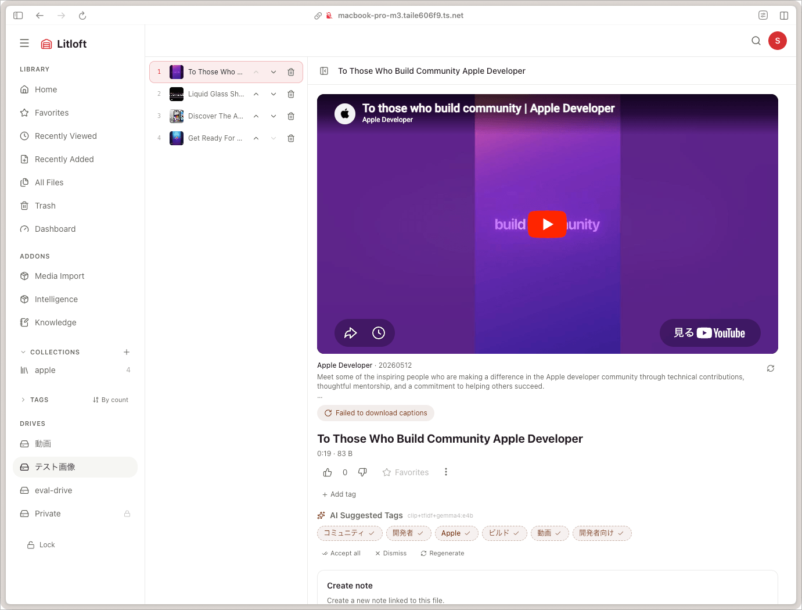

# Collections and favourites

Two lightweight ways to keep things you want to revisit.

## Favourites

Each file has an `is_favorite` flag, toggled by the star on its viewer page or in the file grid.

- Favourites are **per drive**, not per viewer. If you share a Litloft installation, favouriting affects what everyone sees in the *Favourites* carousel on the drive home page.
- Favourites do not affect search ranking by default.
- A `likes` counter is also stored per file. The frontend exposes a like button alongside the favourite star; multiple likes from the same viewer are counted only once on the cookie level.

If you want viewer-private favourites, that is a feature request — currently the model is shared.

## Collections

A **collection** is an ordered list of files within a single drive.



- Create a collection from the drive sidebar or from the file viewer (*Add to collection*).
- Collections are **drive-scoped**: a file belongs to exactly one drive, and a collection can only contain files from its own drive.
- A file can appear in multiple collections.
- The order is editable: drag-and-drop within the collection editor.

### What collections do

- The video and audio players honour the collection order: when one file ends and **autoplay** is on, the player advances to the next item.
- Theatre mode shows the collection queue alongside the player.
- A collection surface is available on the drive home page when at least one collection exists.

### Missing or deleted files in collections

If a file in your collection later goes **missing** (off-disk) or **trashed**:

- The item remains in the collection (it is not silently removed).
- The frontend renders it with a muted style and disables play.
- Restoring or recovering the file makes the collection item playable again.

Adding a missing or trashed file to a new collection is rejected (`active_file_filter()` excludes them at the API level).

### Sharing a collection

There is no built-in public sharing. Within a Litloft instance, every viewer who has access to the drive sees the same collections. To export, you can fetch the collection's items via the API:

```
GET /api/drives/<drive>/collections
GET /api/drives/<drive>/collections/<id>
```

…and reconstruct it elsewhere (filenames, file_ids, etc.).

### Common patterns

- **Watch later** — a single global *Later* collection where you stash anything you spot.
- **Channels** — one collection per recurring source (a podcast feed, a video creator's videos).
- **Topical** — *Cooking shows*, *Travel vlogs*; complements tag filters when the boundary is fuzzy.

## Pinned folders

A folder you pin is kept on the drive home page even if it has had no recent activity. Pins are per-drive and shared (same model as favourites).

- Right-click a folder → **Pin**.
- Click the pin icon on a pinned folder card to unpin.

## Smart folders

A *Smart Folder* is a saved search rather than a curated list. See [search](search.md#saving-as-a-smart-folder).

## Continue watching

Not user-curated, but a sibling concept: the *Continue watching* row on the drive home page lists files you have started but not finished. Backed by `WatchHistory` rows that have not passed 90% (`playback_position < duration * 0.9`). There is no lower bound: rows sit out naturally because a file you only opened records `0`, and `0 < 0` is false. See [comments and watch history](comments-history.md).
