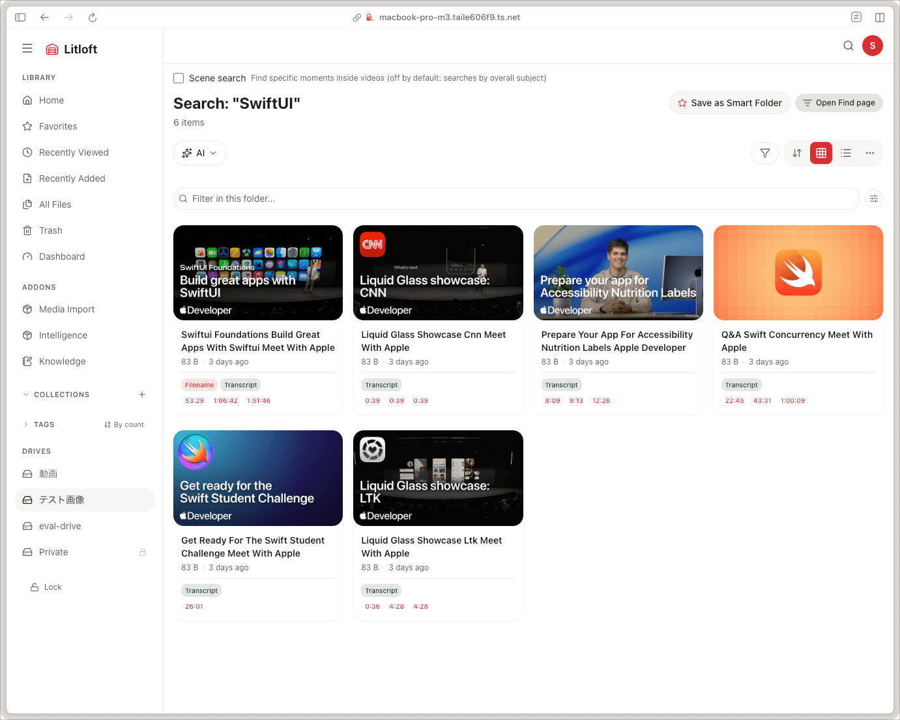
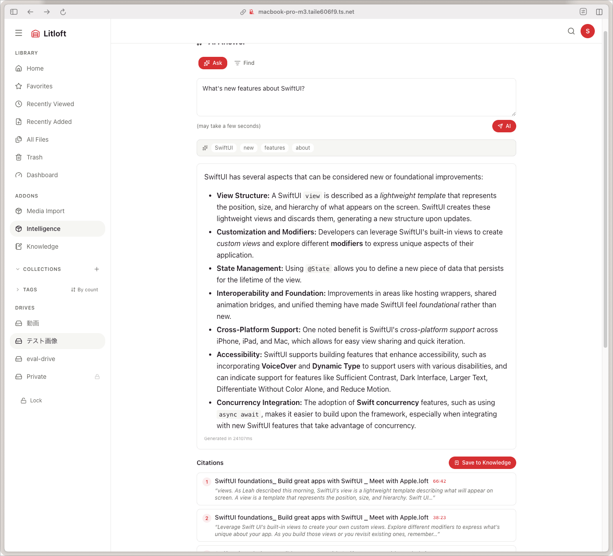

# Search

Litloft has search at three layers, increasing in capability:

1. **Built-in keyword search** — always available; matches the title and the folder path.
2. **Filters** — type and sort; combine with a keyword. Tag filtering has its own entry point (the sidebar).
3. **Semantic, Ask, and Find** — provided by the [intelligence addon](../addons/intelligence.md); embeddings over text, transcripts, and images, plus question answering.

Search is **drive-scoped** — it never crosses drive boundaries. Everything below lives inside one drive.

## The search modal

The search button in the header opens a modal, and so do two keyboard chords: `Cmd/Ctrl+K` and `Cmd/Ctrl+Shift+F`. Both open the same modal — see [keyboard shortcuts](keyboard-shortcuts.md#global) for the full list.

Before you type anything, the modal is a **switcher**: it lists the files you most recently opened in this drive, then the search terms you have used before.

- **Recently opened files** come from your watch history on the server, so the list follows you between devices and browsers. Opening a file's detail page is enough to put it there — it is not limited to media you played.
- **Recent searches** are stored per drive in your browser, up to 20 terms. Each row has two small buttons: one fills the input with that term instead of running it, the other drops it from the list.
- Arrow keys walk both sections as one list, and Enter activates the highlighted row.

The modal only ever shows the drive you are currently in — it never crosses a drive boundary, and outside a drive it just asks you to open one first.

Once you type, the modal runs the same search the search page does (see below) and shows the top 8 hits, plus a row that takes you to the full result page.

It arrives in two stages. Name matches come back in a single round trip and are drawn straight away, so typing a filename you already know gets you there without waiting. If the drive has semantic search, the footer says it is still looking by meaning; when those hits land the list is re-ranked with them mixed in, which can move rows. On a drive without the intelligence addon that second stage does not exist, and the footer says nothing — there is no result to wait for.

Each hit shows its title, and under it a second line only when that line says something the title does not — the folder the file sits in, or a filename the title no longer derives from. A file called `kyoto.mp4` still titled "Kyoto" gets its folder or nothing at all; the same file retitled "Autumn in Kyoto" shows its filename again, because by then the filename is a fact the title has stopped carrying.

## Built-in keyword search

`/drive/<name>/search?q=<query>`

- Matches the **title** and the **folder path**. The title starts out as the filename with the extension dropped, so filename search works out of the box; renaming the title changes what a keyword search sees.
- Case-insensitive, substring match. No fuzzy matching.
- Each result carries a small badge saying where it matched — a filename hit, a folder-path hit, or both. The badges are one word each, and **What the badges mean** at the bottom of the search popup explains all of them, whether or not one is on screen at the time. Press Escape once to leave the list of meanings and go back to your results.
- A folder-path match is deliberately ranked low, so searching `kyoto` surfaces the files under `travel/kyoto/` without burying a file actually named for Kyoto.

The description field is not searched.

## Filters

Above the result grid you find:

- **Type filter** — all / video / image / audio / document (markdown, pdf) / archive / other. The same eight kinds the folder toolbar offers; Markdown and PDF sit *under* Document, so choosing Document returns them too. One at a time, not a multi-select.
- **Sort** — relevance (the default while searching), newest, oldest, title A-Z, title Z-A, largest, smallest, most liked, least liked, random. Relevance is offered only while a query is active.

Filters are reflected in the URL so a link is shareable.

There is no tag filter on the search page. Tags are filtered from the sidebar instead — see [tag filtering](#tag-filtering) below.

## Saving as a Smart Folder

When you have a query and filter combination you want to keep:

- Click **Save** beside the results heading, then name the Smart Folder.
- Smart Folders appear in the sidebar. The chip beside the heading turns into **Saved: {name}**, with Update / Rename / Delete behind it.
- A Smart Folder stores the query, the kind filter, and the sort — not a tag.
- It can only hold four kinds: **Video**, **Image**, **Audio** and **Document**. Saving a search narrowed to Archive, Other, Markdown or PDF fails with an error and leaves the dialog open — nothing is silently dropped. Use **Document** to cover Markdown and PDFs.
- They re-evaluate live: a Smart Folder defined as `invoice` + `document` always shows the current matching files.

Smart Folders are drive-scoped and shared across viewers of that drive.

## Tag filtering

Tags are filtered from the **Tags** section of the sidebar, not from the search page. The list is scoped to the folder you are in, and clicking a tag filters that folder's whole subtree. See [tags and relations → tag filtering](tags-and-relations.md#tag-filtering-and-scope) for the details, including how to widen a tag filter back out to the whole drive.

Where the tags themselves live depends on the file type — frontmatter for Markdown, the database for everything else — but the filter treats both identically. That split is explained on the [tags and relations](tags-and-relations.md) page.

## Semantic search (intelligence addon)

When the [intelligence addon](../addons/intelligence.md) is enabled for a drive, semantic hits are folded into the **same result list** as the keyword hits. There is no separate mode to switch into: run a search and the list is already the merged one.



- Embeddings cover text, transcripts, and a representative CLIP frame per video. Hybrid retrieval: BM25 + dense vectors blended with `search.alpha` (`0.7` in the shipped config).
- Each card shows why it matched — filename, path, metadata, audio, content, scene, or thumbnail — using the same badge row as a keyword-only result.
- Transcript and scene hits add clickable timestamps that jump the player straight to that moment. Up to three are shown, on the card and in the modal alike; if the hit names more moments than that, a quiet `+N` says how many were left out. Two hits that land in the same second — a spoken phrase and a scene, say — are one moment and get one timestamp, not two identical ones. The overflow count is not clickable: it knows how many moments were dropped, not which one you meant.
- PDF hits list the pages they matched.

Without the addon the list is keyword-only, and the badges simply say so.

### Result snippets

Every hit backed by text shows one **snippet** — the single strongest quotable excerpt behind the match, taken from a transcript segment or from the body of a Markdown, plain-text, or PDF file. Only one snippet is shown per hit, and only the strongest one; a scene match carries no words, so it gets timestamps instead.

The snippet itself is core, so it appears whatever addons you have installed. The small **capture** action beside it is contributed by the [knowledge addon](../addons/knowledge.md): it adds the verbatim quote, together with a locator (timestamp for audio and video, page for a PDF), to the capture basket for later use in a note. With Knowledge not installed, the snippet is still there — just without that button.

### Scene-search toggle

For "find a moment" queries (e.g., *the part where the cat jumps off the table*) flip the **Scene search** toggle above the results. The retriever then includes per-frame CLIP embeddings extracted by the indexer, returning timestamps within video files. Clicking one jumps the player to that timestamp.

The toggle is off by default — scene frames add noise to ordinary "videos about X" queries — and its state is kept in the URL, so the browser back button restores it.

Low-confidence frames are filtered out by `search.min_score_clip` (representative frames) and `search.min_score_clip_thumbnail` (per-second frames).

## Ask (RAG)

Ask lives on the intelligence addon's own page, `/drive/<name>/addons/intelligence`, reachable from the addon entry in the sidebar. It is question answering over your library:



- Type a natural-language question.
- The intelligence addon retrieves relevant chunks (BM25 + dense), packs them into an LLM prompt, and streams back the answer with **citations** linking to the source files (and timestamps for video).
- A *no strong source* warning appears when retrieval did not find supporting context.

Ask requires `features.rag: true` in `addons/intelligence/search-config.yml` (also editable from the admin settings GUI) **and** a configured LLM provider. With either missing, the page and the Find chip stay hidden.

Ask is **stateless** — it does not write to the core DB or to the addon DB. Each question is its own retrieval and generation.

### Find mode

Find is the file-listing sibling of Ask, on the tab beside it (`/drive/<name>/addons/intelligence/find`). While a search is active, a **Find** chip in the search page header hands the current query over to it.

The LLM decomposes your question into structured criteria and the retriever runs against them, but no answer is generated — Find returns files and the retriever's own verbatim excerpts, nothing written by a model. It is gated exactly like Ask.

### Privacy of Ask

When Ask is enabled, the LLM provider receives the contents of retrieved chunks. For sensitive drives:

- Use a **local LLM** (e.g. ollama) so nothing leaves the machine.
- Or **disable Ask per drive** via `drives.json`:

  ```json
  { "addons": { "intelligence": { "rag": false } } }
  ```

The intelligence addon enforces this both pre-call (in the host proxy) and inside the worker.

### Hierarchical retrieval

For drives with many files, the retriever runs in two stages:

1. **Coarse**: rank files by their short summaries to find candidates.
2. **Fine**: retrieve chunks within the top candidates.

The threshold and shortlist size are tunable in `rag.hierarchical`; on small drives the shortlist is bypassed entirely. See the [intelligence addon docs](../addons/intelligence.md#configuration-reference).

### Personal history scoping

If `rag.personal_history.enabled` is on, Ask weights files the current viewer has watched recently — useful for queries like *what was the name of that thing in the talk I watched last week?*

## Duplicate detection

The admin dashboard has a **Duplicates** section: pick a drive and it lists files that share content.

- Grouped by content hash **and** file size together, so two files that merely share their first megabyte are not reported as duplicates.
- The hash is computed on first index and stored in `File.file_hash`.
- Each group shows the space it wastes. Pick the copy to keep and the rest go to the [trash](trash-and-missing.md), recoverable like any other deletion.
- Useful when consolidating after a bulk import.

## API

If you script Litloft, note that there is **no standalone search endpoint**. Keyword search is a parameter on the drive file listing:

- `GET /api/drives/{drive}/files?search=<query>&type=...&sort=...&page=...&limit=...`
- `GET /api/addons/intelligence/search?q=<query>` (semantic; requires the `X-HV-Drive` header)
- `POST /api/addons/intelligence/ask` (question answering; streams as SSE)

See the [HTTP API reference](../reference/api.md).
