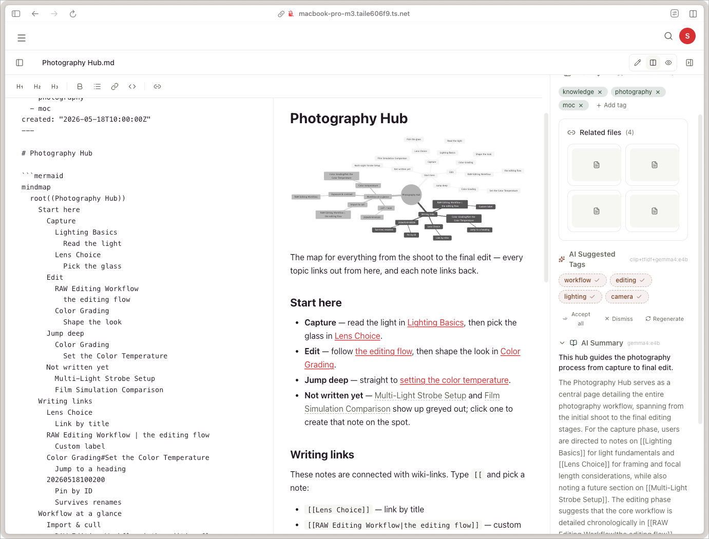

# Tags and file relations

Litloft's tagging is structured but understated. There is no hierarchy and no global tag list — tags are per drive, applied flat. File relations are a separate, typed graph.

## Tags

Open any file's detail page; a **chip editor** below the file information lets you add or remove tags. Tags auto-complete from the drive's existing tag set, and a tag you have just added becomes a suggestion immediately.

What a tag may be:

- At most **10 tags per file**.
- At most **30 characters** per tag.
- Letters, digits, underscores, and hyphens only — no spaces, no punctuation. Non-ASCII letters count as letters, so Japanese tags are fine.
- Tags that differ only in case are treated as one; the first spelling wins.

### Where tags live

The canonical store depends on the file extension:

| File type | Canonical store | Notes |
|---|---|---|
| `.md` | YAML frontmatter (`tags: [...]`) | `File.tags` is a projection cache. |
| Everything else | `Tag` table + `file_tags` junction in the DB | Edited via the chip editor. |

For Markdown files, edits in the chip editor rewrite the YAML frontmatter via `PUT /api/files/{id}/content`; the backend's content handler then re-projects `File.tags` from the new frontmatter.

The projection is committed **separately** from the content write, on purpose. If the projection fails (broken YAML, a DB error on the tag write), the bytes on disk are still correct and durable — only the cached projection is stale, and the next edit, or the knowledge addon's scanner pass, re-projects it.

Chip edits are coalesced with a 500 ms debounce, so a quick add-remove-re-add sequence costs one write rather than three.

The frontmatter parser is implemented twice — once in core (`backend/app/services/frontmatter.py`) and once in the knowledge addon (`addons/knowledge/app/services/frontmatter.py`) — because they live in different containers. Drift is caught in PR review.

### Frontend always uses `saveFileTags`

The frontend has a single helper, `saveFileTags(file, tags)`. It internally branches on MIME type / extension. The UI layer must not decide where to write — see `frontend/src/lib/tags.ts`.

### Why split?

The split optimises for the *primary* tool used to manage each file type:

- For Markdown notes, your editor of choice (Obsidian, Helix, plain `vim`) typically stores tags in YAML frontmatter. Litloft following that convention means external editing stays in sync without extra orchestration.
- For everything else (videos, images, PDFs), there is no equally universal in-file tagging convention, so a database table is the simplest source of truth.

### Tag filtering and scope

The **Tags** section of the sidebar is the tag filter. It lists the tags in play with a count beside each one, and clicking one filters the listing.

The section shows the eight most prominent tags — by count, or alphabetically if you have switched the sort. When there are more, **All tags (N)** sits below them and opens the rest in place; N is the number of tags in scope, not the number still hidden. The list folds back to eight when you move to another folder, because a different folder brings a different set of tags. The heading names the folder it is counting (*Tags — under {folder}*) whenever the scope is narrower than the drive.

The tag you have applied is always shown, ranked or not — the fold is by count, so a rare tag would otherwise filter the listing from a row you could not see, and this section is the only place that shows an applied tag or takes it off.

Both the list and the click are **scoped to the folder you are in**:

- The list shows only the tags used somewhere inside the current folder's subtree, with counts for that subtree — not for the whole drive.
- Clicking a tag filters that same subtree. The count beside the tag and the number of results you get are the same number, for the same folder and the same tag.
- At the drive root there is no folder to scope to, so a tag filter there covers the whole drive.

Note the deliberate asymmetry with plain browsing: browsing a folder shows its **direct children**, while a tag filter shows the folder's **whole subtree**. This is the same behaviour Finder has — you browse one level, but you search everything underneath. The browsing side of this is covered in [browsing files](file-browsing.md).

Other things worth knowing:

- **One tag at a time.** There is no multi-tag AND filter; the URL carries a single `?tag=`.
- Matching is case-insensitive, so `Todo` and `todo` filter the same set.
- Clicking the tag row again clears the filter and returns you to the plain folder listing.
- **Widening back out**: while a folder-scoped tag filter is active, a *Search the whole drive* action appears in the toolbar. It also appears in the empty state, so "no matches in this folder" is never a dead end.
- The filter applies to both Markdown frontmatter tags and database tags transparently — the projection makes them indistinguishable to the query layer.

The autocomplete in the chip editor is drive-wide, not folder-scoped: you can always apply a tag that is only used elsewhere in the drive.

### Auto-tags (intelligence addon)

When the `intelligence` addon is enabled with `features.auto_tags = "manual"` or `"on_index"`, the LLM proposes tags for each file. Proposals are **not applied silently**:

- The file detail page shows them in a **suggested tags** section, separate from the chip editor.
- Accept a tag one at a time, or **Accept all**. **Dismiss** clears the whole set of suggestions, and **Regenerate** asks for a fresh set.
- Accepting merges the tag into the file's existing tags through `saveFileTags` (retrying once if the file changed underneath), so a Markdown file's accepted tag lands in its frontmatter like any other edit.

See [intelligence addon → auto-tags](../addons/intelligence.md#auto-tags).

### Internal API write endpoint

`POST /api/internal/files/{id}/tags` (gated by `CORE_INTERNAL_SECRET`, responds `204`) is reserved for the knowledge addon's note scanner, which needs to project frontmatter changes made by an external editor. **Frontends must not call this** — use the public `PUT /api/files/{id}/tags` instead.

## File relations

A *file relation* is a typed link between two files in the same drive: `(file_a, file_b, kind)`.

- `kind` is an opaque lowercase slug (up to 32 characters), validated by shape rather than against a fixed list, so addons can introduce their own kinds without a core change. In practice everything shipped today writes `related` — the core's Markdown link sync and the knowledge addon's note promotion both use it.
- Relations are **bidirectional in queries**. Looking up relations of file X returns rows where X is in either column.
- The same pair cannot carry the same `kind` twice, and a file cannot relate to itself.
- Both ends of a relation must be in the same drive; cross-drive links return `400 Bad Request`.
- The foreign key to `files.id` is `ON DELETE CASCADE` — purging a file removes its relations.

### Markdown-derived relations

For `.md` files, the backend extracts the links in the body and synchronises them into the relations table on every save, as `kind = related`. Two link forms count:

- `loft://<file_id>` — a direct reference to a Litloft file.
- `[[wiki links]]` — resolved against Markdown files in the same drive.

The sync is a full reconciliation, not an append: links you remove from the note lose their relation too. So a Markdown note that links to other Litloft files automatically populates that file's *Related files* section, and vice versa.

Like the tag projection, this runs in its own commit — a failure to resolve links never rolls back the content write.

### Where relations show up

The file detail page has a **Related files** section listing every relation, in both directions, newest first, with a count in the heading. Trashed files drop out of the list; missing files stay, greyed out and labelled, so the link is not silently forgotten while a drive is unmounted.

The section hides itself entirely when a file has no relations.

### API

Reading relations for a file is a public endpoint:

- `GET /api/files/{id}/relations?kind=` — both directions, drive access enforced on the source file.

Writing them is Internal API only, for addons:

- `POST /api/internal/file_relations` — create.
- `GET /api/internal/file_relations?file_id=...` — list both directions.
- `DELETE /api/internal/file_relations/{id}` — remove.

See [Internal API policy](../developer-guide/addon-dev.md#internal-api-policy) for the rules on what may live there.
