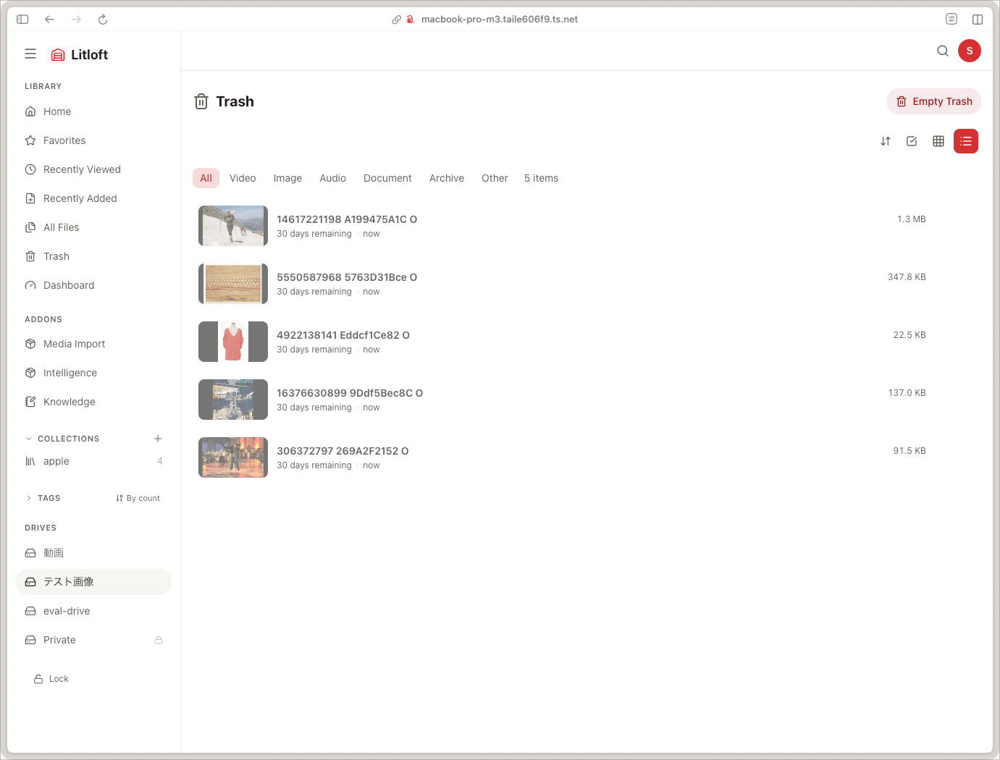

# Trash and missing files

A Litloft file is in exactly one of three states: **Active**, **Missing**, or **Trash**. The states are mutually exclusive and encoded by two columns:

| State | `deleted_at` | `missing_since` | Auto-purge |
|---|---|---|---|
| Active | NULL | NULL | — |
| Missing | NULL | set | Never |
| Trash | set | NULL | After 30 days |

This three-state model is deliberate: Litloft treats the database not as an FS cache but as an independent source of truth for data that cannot be regenerated from the filesystem (watch history, comments, tags, transcripts, embeddings).

## Active files

The default state. Visible everywhere; default queries pass through `active_file_filter()` which excludes the other two.

## Missing files

A file becomes **Missing** when the periodic scanner notices it has disappeared from disk:

- The DB row is **kept**.
- `missing_since` is set to the moment the absence was first observed.
- A `files.missing` WebSocket event fires.

This handles the very common situation of a network share unmounting, a USB disk being unplugged, or a directory being moved out of band. When the file reappears, the scanner clears `missing_since` and emits `files.recovered`.

### What is preserved

Everything that depended on the file ID:

- Comments, tags, watch history, collections.
- Thumbnails (kept on disk; reused on recovery).
- AI artefacts (transcripts, summaries, embeddings).

### What is restricted while missing

- **Streaming** returns `410 Gone`.
- **GET on the file** and **mutating endpoints** return `404 Not Found`.
- **Thumbnails** still serve normally.

The frontend renders missing files with a muted card; the viewer page is reachable but the player is replaced by a *file is missing* notice.

### Reviving a missing file

Two ways:

1. **Restore the file** to the same path on disk. The next scanner pass detects the recovery, clears `missing_since`, and emits `files.recovered`.
2. **Upload to the same path** through Litloft's UI. The upload pipeline detects the existing missing record and revives it (no `INSERT` — that would violate the `UNIQUE(path)` constraint).

### Mount-failure protection

If the drive's root path does not exist when the scanner runs, the scanner returns early. This prevents a single mount failure from cascading every file in the drive into the missing state.

### No auto-purge

Missing files are kept indefinitely until the user explicitly purges them. Use the *Missing* view in the admin UI or the `purge_all_missing` API to clean up:

- Commits in chunks of 200.
- Emits a `files.purged` webhook per batch.

## Trash

Trash is the result of a user-initiated soft delete:

- `deleted_at` is set to the deletion time.
- `missing_since` is cleared.
- The file on disk is **not** moved or removed.
- A `files.deleted` (sometimes called `files.removed` in older docs) event fires.

The 30-day clock starts ticking. Trashed files:

- Do not appear in default queries.
- Cannot be added to new collections.
- Existing collection entries pointing at them remain (rendered as muted, non-playable).
- Are visible in the **Trash** view, where they can be restored or purged.

### Restore from trash

`restore_file()` clears both `deleted_at` and `missing_since`. The dual-clear is a defensive safety net for situations where the file went both missing and trashed in the wrong order — a future bug or an out-of-band edit will not leave you in a half-restored state.

### Auto-purge

A background task runs at backend startup and every 24 hours:

- Selects rows where `deleted_at < NOW - 30 days`.
- Deletes the on-disk file.
- Deletes the DB row (cascades remove relations, comments, watch history, etc.).
- Cleans up empty parent folders.
- Emits `files.purged` (one event per batch of 200).

## Hard delete (purge from trash)

You can purge immediately without waiting 30 days:

- From a single trashed file: **Delete permanently**.
- From the *Trash* view: **Empty trash** (with confirmation).

Hard delete is irreversible. The file on disk is removed.

## What `files.purged` means

`files.purged` is emitted **only** on explicit user-initiated hard delete or from the auto-purge cycle. The scanner never emits `files.purged` — when it observes a disappearance it emits `files.missing`. This separation matters for addons: a purge implies "this file is gone forever, drop everything", whereas missing implies "we expect this to come back".

## Operational notes

- The trash retention is currently fixed at 30 days. Configurable retention is a feature request.
- Hard delete cleans up empty parent directories on the host. To prevent this, do not delete the last file in a folder you want to keep.
- For policy-disabled drives, addons should clean up their own data on receipt of `files.purged`.
