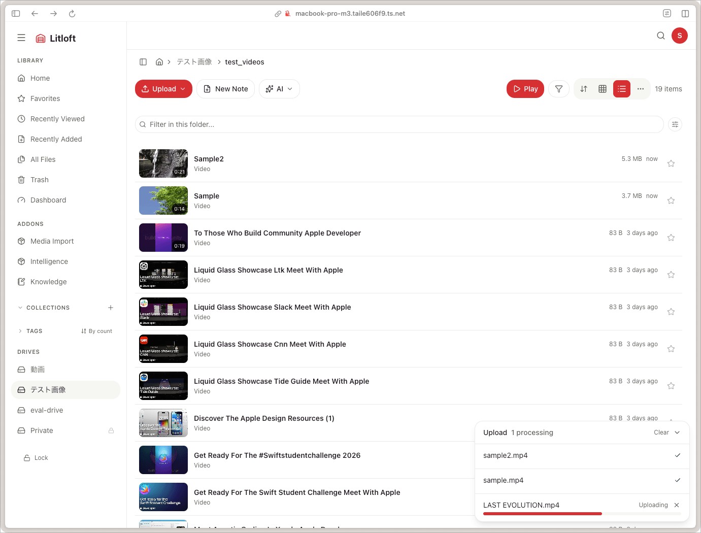

# Upload and file operations

Litloft accepts files via drag-and-drop or a file picker, then runs them through a chunked upload pipeline that copes with large files and large folders.

## Uploading files

Drop files anywhere on a folder page, or use the **Upload** button.

- **Folder upload** is supported in browsers that expose `webkitdirectory`. Drop a folder and the relative tree is preserved — each file's path under the dropped folder is recreated inside the target folder.
- **Multi-file upload** is supported. Files are queued and two are uploaded at a time; within one file, chunks go up one after another.
- An upload **progress drawer** at the bottom of the screen lists each file with its status (pending / uploading / processing / complete / error / cancelled) and a progress bar. You can cancel anything that has not finished, clear the finished entries, and collapse the drawer. It does not show transfer speed or an ETA.

### Chunked upload protocol

Behind the scenes:

1. `POST /api/drives/<drive>/upload/init` — declare the filename, size, MIME, and target folder; returns an `upload_id` and the chunk count.
2. `POST /api/drives/<drive>/upload/<upload_id>/chunk` — push one chunk.
3. `POST /api/drives/<drive>/upload/<upload_id>/complete` — finalise; the backend concatenates the chunks, verifies the assembled size against the declared one, generates a thumbnail, probes duration and chapters for media, and inserts the file record.
4. `DELETE /api/drives/<drive>/upload/<upload_id>` — cancel and discard the partial upload. The drawer's cancel button calls this.

The chunk size is chosen by the browser from the file size: 5 MiB up to 1 GB, 25 MiB up to 10 GB, and 100 MiB above that. Fewer, larger chunks keep the round-trip count sane on multi-gigabyte files.

`init` refuses upfront in two cases: **409** if a file already exists at that path, and **507** if either the temp directory's filesystem or the drive's has less than 110% of the declared size free.

**Uploads do not resume.** The session lives in the backend's memory and the file handle lives in the tab, so closing or reloading the tab ends the transfer; there is nothing to pick back up, and starting again re-sends the whole file. Chunks are not retried on failure either — one failed chunk fails that file, and the drawer shows the error. Abandoned temp directories are swept away after 24 hours.

### Limits and constraints

- **Size**: 50 GB per file by default. Set `LITLOFT_MAX_UPLOAD_SIZE_GB` to change it; oversize files are rejected at `init` with a 400. Reverse proxies in front of Litloft (if any) often impose their own limit on the individual chunk requests.
- **Disk space**: the 110% headroom check above, evaluated against whichever of the two filesystems has less free space.
- **Path safety**: filenames and folder paths are normalised and validated against the drive root, so a crafted `relative_path` from a folder upload cannot escape the drive.

### Reviving a missing file via upload

If a file went *missing* (file deleted from disk, DB row kept), uploading the same path **revives** the existing record rather than inserting a new row. This preserves tags, comments, watch history, and AI artefacts that referenced the original, and notifies addons with a `files.recovered` webhook.

If the row at that path is in the **trash** instead, the re-upload supersedes it: the trashed record is dropped and the upload takes the path as a fresh file.

## Renaming, moving, and copying

Renaming a folder, or a file in the tree pane, now happens **in place** rather than in a dialog — see [renaming in place](file-browsing.md#renaming-in-place). The `…` and right-click menus still offer:

- **Rename** — change the filename. Forbidden characters, leading dots, and names over 255 characters are rejected; an existing file at the new path returns 409. Renaming a `.md` file also rewrites `[[old-name]]` references to it in other Markdown files in the same drive, best-effort (the rename itself stands even if the rewrite fails). See [tags and relations](tags-and-relations.md).
- **Move** — change the parent folder. The move dialog browses the folders of the drive the file is already in, so a move made this way lands in the same drive.
- **Copy / Cut / Paste** — put a selection on a clipboard, navigate, then paste into the target folder. Copy duplicates; cut moves. The clipboard is kept in `sessionStorage`, so it survives a reload, and a banner above the file list offers **Paste here** wherever you land.

Paste targets whichever drive and folder you are standing in, and the move and copy endpoints both take a target drive, so **cutting or copying in one drive and pasting in another moves or copies the file across drives.** The file is relocated on disk between the two drive roots and its record follows it. A name already taken at the destination is refused (409) for a move, and suffixed for a copy.

A copy gets a new file id, and starts unliked, without the favourite flag, and with empty watch history; tags and comments are not duplicated. If the name is taken in the target folder, the copy is suffixed `_copy`, then `_copy_2`, `_copy_3`, and so on.

Batch operations work the same way: turn on select mode, pick the files, then choose the action from the selection bar. Batch move and batch rename report per-file errors rather than failing the whole run.

### Batch rename

The selection bar's **Rename** opens a preview dialog with three modes:

- **Template** — build the new name from `{original}` and a counter `{n}`, with a configurable start number and zero-padding.
- **Regex** — a search pattern and a replacement, validated as you type.
- **Prefix / suffix** — add or remove a fixed prefix or suffix.

Every mode shows old-name → new-name for the whole selection before you commit, and counts how many names actually change.

### Empty folders

When a move or delete leaves a parent folder empty, Litloft records it in the `empty_folders` table so the folder keeps appearing in the listing (the folder list is otherwise derived from the paths of the files in it). A later write into that path clears the tracker.

## Editing text in place

The in-browser Markdown editor is supplied by the **knowledge** addon, which contributes an *Edit Note* section to the file detail page. Without that addon installed, text files are read-only in the browser. See [the knowledge addon](../addons/knowledge.md).

The write endpoint itself is core, and these limits apply to anything that uses it:

- Only `text/markdown` and `text/plain` can be written this way; anything else is refused with 415. Larger or binary files must be replaced by re-upload.
- Content is capped at 1 MB per write (413).
- Writes are guarded by an ETag: the request must carry `If-Match` with the ETag of the content it was based on, and a stale one is rejected with 412 rather than silently overwriting a change made elsewhere. The editor surfaces that as a conflict.
- The editor autosaves 2 seconds after you stop typing. Tag-chip edits on a Markdown file rewrite the frontmatter through the same endpoint, coalesced with a 500 ms debounce.
- For Markdown, frontmatter edits trigger a tag re-projection into the database.

## Soft delete (trash)

Deleting a file moves it to the trash:

- `deleted_at` is set; `missing_since` cleared.
- The file remains on disk in its original location — the OS-level filesystem is untouched until purge.
- Trash auto-purges after 30 days. Auto-purge runs at backend startup and every 24 hours.
- Restore at any time before purge. Restore clears both `deleted_at` and `missing_since` (a defensive safety net for out-of-band edits), and fails with a 404 if the file has since disappeared from disk.

A *missing* file cannot be moved to the trash — there is nothing on disk to trash. Purge it directly instead.

For full semantics, see [trash and missing files](trash-and-missing.md).

## Hard delete (purge)

Purging is **irreversible** — both the row and the file on disk are removed, along with its thumbnail and any cached conversions.

- From the trash view, **Empty Trash** purges **everything** in that drive's trash, whatever its age, after a confirmation. It is not limited to items past the 30-day mark.
- Per file, **Purge** in the trash row removes immediately.
- Empty parent directories left behind are removed afterwards, walking up to the drive root.

A `files.purged` event is emitted for user-initiated purges and for the 24-hour auto-purge cycle. It is an **addon webhook**, not a browser event: addon services are notified over HTTP, while other open tabs are not. The scanner never emits it — a file that vanishes from disk becomes *missing*, not purged. See [real-time updates](file-browsing.md#real-time-updates).

## Downloading

- **Per file** — **Download** in the file's right-click menu and in the viewer; streams the original with `Content-Disposition: attachment`.
- Streaming responses advertise `Accept-Ranges: bytes` and honour range requests, so resumable downloaders and seeking both work.

There is no batch download: the selection bar has no zip action, and the backend has no endpoint that packs several files into one response.

## Archive entries

Litloft can look inside **ZIP** files (`.zip` only — TAR and RAR are not treated as archives) and does not extract them on the server. Opening one shows its contents as a browsable listing, up to 10,000 entries, with the same grid/list toggle as a folder. From there:

- **Download** an individual entry — it is decompressed in memory and streamed straight to you. Common image formats and plain text open inline; everything else downloads.
- **Download** the whole archive from the toolbar.

Entry reads are capped at 50 MB per entry (413 beyond that, checked both against the declared size and the actual decompressed bytes, so a zip bomb cannot get through) and at 3 concurrent reads across the whole server. Symlink entries are skipped.

There is no "extract into the drive" action; to get files into the drive, download them and upload them back.

## Backups

For backing up the data the user-facing tools touch, see [backup and restore](../admin-guide/backup-restore.md). The short version: snapshot `data/` and your drive directories, both at the host filesystem level, while the stack is up.
