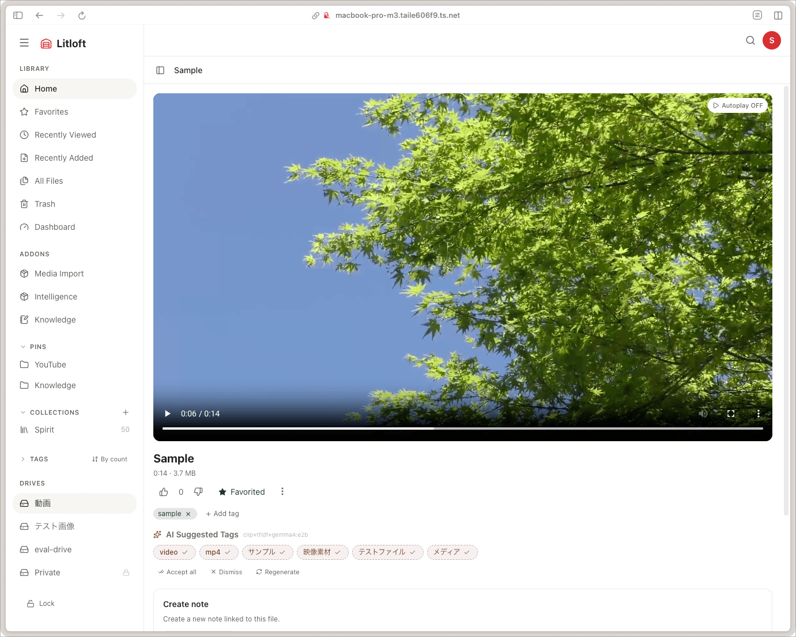
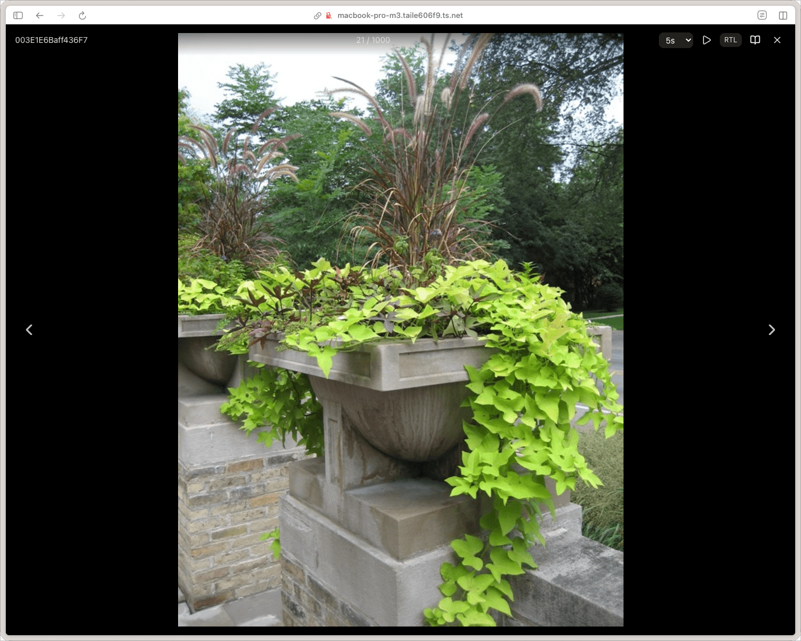
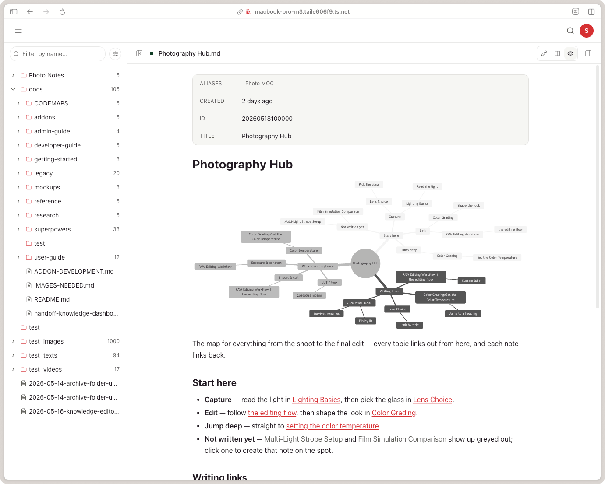

# Viewers and players

Litloft picks a viewer based on the file's MIME type. The same file detail page hosts every viewer; only the central component changes. Its address is `/drive/<drive>/<folder>?file=<id>` — `/files/<id>` still works and redirects there, except in collection playback, which stays on `/files/<id>` so the collection list and the player can share one column.

The page has three parts: a **page row** at the top, the **viewer** below it, and an **inspector** down the right-hand side. The viewer keeps the things that belong to it and nothing else — for a video that is the player, its description and its long AI summary. Everything that is true of any file, whatever kind it is — its title, length and size, like and favourite, tags, relations, comments — is in the inspector, in the same place on every page.

**The viewer gets the column to itself**, which matters most where the viewer is long: a 190-page comic used to open with about 100px of archive listing and everything else stacked below it, so the deeper the archive the less of it you could see, and going down a level moved every section under it. Video, audio, Markdown, PDF, archives and images all read this way. Plain text and the Office formats still stack.

Addon sections (AI summaries, tag candidates, visual descriptions) appear once they have something in them: a section that has not been generated yet is not shown, and the way to generate it is the **AI** menu in the inspector, beside the like and favourite buttons. Anything already generated keeps its own section, with its own regenerate control, and drops out of that menu. Two things are not sections: the **transcript** is a tab of its own, and **similar files** sits under the inspector's **Related** heading beside the file's stated relations.

## The page row

Every file detail page starts with the same row, whichever viewer is below it and whichever
address you arrived by.

- **The path**, from the drive down to the file, with every step above the file clickable. This
  is how you go back up one folder, or three.
- **On a narrow screen** the path collapses to its last step — `‹ folder name` — which is the
  way back on a phone.
- **Type-specific controls** sit to its right: a Markdown note puts its save indicator and its
  Edit / Split / Preview switch there, and its file name in the path is click-to-edit.
- **The inspector toggle** is last, on the pages that have an inspector.

During collection playback the back control means something the path cannot say — the
collection you were playing, not the folder this track happens to live in — so there it
stays on the row at every width, beside the path rather than instead of it.

## The inspector

A column down the right of the page, the same width and the same shape on every kind of file.

- **The top part does not move.** Title, length and size, the like / favourite / **AI** / `⋮` row, and tags. It stays put while the rest scrolls, so those controls are in the same place on every file whatever is below them.
- **Below it, tabs** — but only when there is more than one. **Info** is always there: relations, comments, EXIF where a file has it, and whatever addon sections apply. A media file with chapters gets a chapter tab, and one on a drive with the transcript addon switched on gets a transcript tab. A file with nothing but Info gets no tab strip at all, which is what a Markdown note has always looked like.
- **A tab appears when it has something in it.** A file with no chapters has no chapter tab, and a video that has never been transcribed has no transcript tab — the addon is asked whether it has anything for this file rather than merely whether it is switched on. A panel that is still loading may take a moment to claim its tab.
- **Open and close it** with the toggle at the end of the page row, or with `Cmd/Ctrl+\`. It starts open on a wide screen. Closed, nothing of it is left behind on the page.
- **Where there is not room for both**, it covers the right side of the page instead of squeezing what is under it — the same width either way, because a narrower inspector wraps Japanese at a dozen characters a line. This goes by the room the page actually has, not by the window: with the folder tree open, the tree and the sidebar have already taken most of a laptop screen.
- **On a phone** the inspector is a bottom sheet with the same contents, and it rests rather than closes. A strip along the bottom always carries the file's name and the four buttons that act on it — like, favourite, **AI**, and the `⋮` menu — so those are in the same place on every file without opening anything. The rest of the file's details, including its trust state, are in the sheet itself. The same toggle raises it to half the screen, and the handle drags it to full; swiping down, tapping outside or pressing Escape sends it back to the strip rather than away.

## The player on a phone

It sticks to the top of the page as you scroll, so the video stays on screen while you read what is under it. There is no separate picture-in-picture window to manage — it is the same player throughout, so nothing restarts. Pulling the sheet all the way up covers it; a drag back down brings it into view again.

## Chapters and the transcript, beside or below

Video, audio and `.loft` files have panels that follow playback — chapters, and the Intelligence addon's transcript. A toggle in the page row decides where they go.

- **Beside** — each becomes a tab in the inspector, so it sits alongside the player and follows the clock while you scroll the page past it. This is the default. Choosing it opens the inspector if it was closed, and leaves it open for the drive, since that is where the panels now live.
- Because beside is the default, a video opened on a window narrow enough for the inspector to start closed arrives with both panels behind it, without you having pressed anything. The inspector toggle at the end of the page row brings them back.
- **Below** — they move into the page instead, directly under the description: the transcript in a single column at a comfortable reading width, with the chapter list beside it as its index. The box has its own scrollbar and a height limit, so playback moving the transcript along does not move the page under you.
- The choice is saved in `localStorage`, per device, and a choice you have already made is kept. **On a phone it does not apply**: there is no beside, so both panels go into the bottom sheet and the toggle is not shown.
- The toggle appears only when there is something to move — no chapters and nothing from an addon for **this file** means no control. An untranscribed video with no chapters is offered nothing, rather than a control that moves an empty panel between two empty places.
- **During collection playback** (`/files/<id>`) the page keeps its older layout, without an inspector, and "beside" there means a column next to the player rather than a tab. That form needs room — at least 60 rem of page width — and falls back to the stacked one on a narrower window. Audio never takes it there: the player is a couple of hundred pixels tall and a column beside it would leave half the width empty.

## Chapters

A chapter list, seekable by click, with the chapter the playhead is inside highlighted. It sits wherever the beside/below toggle puts it.

- **Where they come from** — three producers, all writing to the same core table:
  - **Container metadata**, read with `ffprobe` when the file is first scanned or uploaded (`source: "extracted"`).
  - **A `.loft` provider**, from the metadata captured at import time by the [media_import addon](../addons/media-import.md) (also `extracted`).
  - **An LLM**, through the Intelligence addon's *Suggested Chapters* section on the file detail page. Like auto-tags this is a Suggest → Approve/Dismiss workflow; approving promotes the set into the core table as `curated`.
- **Curated wins.** Once a person has approved a set, a later re-probe or a Media Import refresh leaves it alone.
- **Collapsing** shrinks the panel to a single line naming the chapter the playhead is inside. Expanded, the header goes back to the plain label — the highlighted row already says where you are.
- A chapter with no usable title is dropped rather than rendered blank, so the list may be shorter than the file's own marker count.
- Chapter lists are read-only in the core UI: there is no chapter editor.

## Timestamps in a description

On a video or audio file, timestamps written in the file's **description** — the text under the title, which you edit yourself — become buttons that jump the player to that position, the way a YouTube description's index does. Nothing is saved; the links are worked out from the text each time the page is drawn.

- **Recognised forms** are `M:SS` and `H:MM:SS` — `0:00`, `12:34`, `1:02:03`. Seconds always take two digits, so `16:9` and `1:1` stay as text.
- They are linked **wherever they appear**, whether the line is an index entry (`1:23 Method`) or a mention inside a sentence (`covered from 12:05`).
- **A timestamp longer than the file is left as plain text.** This is what keeps a description like `starts at 21:00` from becoming a link on a short video. On a file longer than that, it cannot be told apart from a real position and will be linked.
- The description is **your own text**. A `.loft` file's imported description is shown separately, below the player, and its timestamps arrive as [chapters](#chapters) instead.
- These links never change a file's chapters, and a description with no timestamps looks exactly as it did before.

## Video player

Litloft draws **its own control bar** over the video frame. The same bar, gestures and settings sheet serve both the native `<video>` element and the `.loft` player, so the two behave identically.

- **Two layouts, picked by input device** — a pointer (`pointer: fine`) gets a compact bar that reveals on movement and a settings popover parked above the button; a finger (`pointer: coarse`) gets larger targets and a settings sheet rising from the bottom edge. A tablet paired with a keyboard case can switch mid-session.
- **Gestures differ by input device, and do not overlap.** On touch: a single tap surfaces the bar, a double-tap on the left or right half skips 10 s that way (further taps within 1.3 s keep adding to the same hop, with the running total on screen), a long press boosts a *playing* file to 2x until you let go, and a vertical swipe or a pinch enters and leaves fullscreen. With a mouse: click plays and pauses, double-click toggles fullscreen — there is no tap-to-skip and no speed boost. See [keyboard shortcuts and gestures](keyboard-shortcuts.md).
- **Settings sheet** — captions on/off and playback speed (0.5, 0.75, 1, 1.25, 1.5, 2) are core's own. The player's owner contributes rows of its own to the same sheet, which core keeps opaque: the native player adds Picture-in-Picture, autoplay, a hand-back-to-browser-controls switch, and a subtitle track picker when the file has more than one track.
- **Browser controls** — the settings switch hands the frame back to the browser's native bar, which is also where the platform's own fullscreen and AirPlay entries live. A *Use Litloft controls* link under the player takes it back. The choice is remembered per device.
- **Fullscreen** — the browser's Fullscreen API where it exists. No Apple mobile browser implements element fullscreen, so there the player frame is pinned over the viewport with `position: fixed` instead. The frame is styled in place and never moved to a new parent, so an embedded player keeps its position and its API binding.
- **Adaptive streaming** — the backend serves byte-range requests; the player seeks instantly without re-downloading.
- **Resume from last position** — see [shared playback clock](#shared-playback-clock-and-watch-history) below.
- **Subtitles** — sidecar `.srt` / `.vtt` files in the same folder are auto-attached, for `.loft` files as well as for real video. Name them after the video's basename: `movie.srt` (default track) or `movie.<lang>.srt` / `movie.<lang>.vtt` where `<lang>` is a 2–3 letter code (`en`, `ja`, `eng`, …) — each becomes an entry in the language picker, default track first. `.srt` is converted to WebVTT on the fly for the browser player. Subtitle files do not appear as their own entries in the file list. When no sidecar exists, the player offers the Intelligence addon's generated track instead.
- **Picture-in-picture** — `autoPictureInPicture` is enabled where the browser supports it, plus an explicit toggle in the settings sheet.
- **Mini player** — on desktop, scrolling the player out of view reflows it into a fixed 320x180 window at the bottom right. The element is never remounted, so nothing reloads. The window is too narrow for the full control row, so it gets a reduced one: play/pause, the elapsed time, mute, and a scrub bar along the bottom edge, plus the close and restore buttons at the top left. Speed, captions and fullscreen are not there — set them before you scroll away (both preferences carry over), or use restore to bring the full player back. The mini window is not a special case: with a mouse, any Litloft control bar in a frame narrower than 480px reduces the same way. On touch the mobile layout is used instead, at every width.
- **Media session** — lock-screen and OS media-key controls (play/pause, next, previous within a collection).
- **Cast** — Chromecast button when a compatible session is detected.
- **Autoplay** — defaults **off** to respect attention. Toggled from the settings sheet; the choice is persisted in localStorage.
- **Keyboard shortcuts** — see [keyboard shortcuts and gestures](keyboard-shortcuts.md).

## Audio player

Audio keeps the browser's own `<audio controls>` bar rather than Litloft's — there is no frame to draw over.

- Resume from last position and `last_played_at` updated on open.
- Media session for OS controls. Title and subtitle come from Litloft's own metadata (file title, folder path); the artwork is the file's Litloft thumbnail, not embedded ID3 art.
- Cast button and an autoplay toggle sit below the player.

## Image viewer

On the detail page the image has the column to itself, with its EXIF, tags and comments in the inspector, and the full-screen entry point stays in the inspector's action row.

The full-screen image viewer is a page-turner for a folder of images. Archives get a separate viewer built from the same gesture handling, described under [ZIP archives](#zip-archives).

- **Swipe navigation** — horizontal swipe (50 px threshold) advances; swiping right goes to the next image in both reading directions.
- **Edge taps** — tapping the left or right 25% of the screen turns the page. These *are* reading-direction-aware: in *right-to-left* mode (manga, Arabic, Hebrew) they are mirrored, as are the on-screen arrows and the arrow keys.
- **Centre tap** — toggles the controls bar.
- **Slideshow** — play/pause button with an interval of 3, 5 or 10 seconds. Controls fade out three seconds into playback.
- **Spread (double-page)** — shows a landscape image as two half-width pages, turned one at a time, for scanned comics and magazines. Portrait images are unaffected.
- **Reading direction** — LTR (default) or RTL. The toggle appears while spread mode is on.
- **HEIC support** — converted to JPEG on the fly using Pillow + pillow-heif, and cached. ffmpeg-based fallbacks are intentionally avoided because they produce black thumbnails for HEIC.

The file detail page for a single image shows the image itself. The full-screen page-turner opens from the maximise button beside it, and walks the other images in the same folder from there.

## Markdown viewer

Litloft renders Markdown with a curated set of extensions:

- **Syntax highlighting** for fenced code blocks (`highlight.js`).
- **Mermaid diagrams** — lazy-loaded; opt-in only, since Mermaid evaluates string input as code-like configuration. Untrusted sources such as LLM answers render with Mermaid off.
- **GitHub-flavoured task lists** with rendered checkboxes.
- **Frontmatter chips** — YAML frontmatter is parsed and the `tags`, `title`, `description`, and other recognised keys are surfaced as editable chips. Saving chips writes to the file (canonical store for `.md`) and the backend mirrors `tags` into the database.
- **`loft://` internal links** — `loft://<file_id>` (12-char) opens the linked file. The same scheme works in image syntax, resolving to the file's stream URL. Two-way: such links are also synced to the `file_relations` table so the file detail "Related" section works.
- **In-place editor** — where the [knowledge addon](../addons/knowledge.md) is installed and its editor is enabled for the drive, the page switches to a document layout with an edit / split / preview toggle and a side inspector. Saves use a 500 ms debounce to coalesce typing into one HTTP write. Without that addon the Markdown viewer is read-only apart from the frontmatter chips.

## PDF viewer

- The document has the page column to itself; its metadata, tags and comments are in the inspector.
- Rendered page by page with PDF.js (`react-pdf`), inside the page rather than in a browser plugin frame — so text selection works and the Intelligence addon can quote the page you are looking at.
- Page navigation and a zoom control (0.5x to 2x in 0.25 steps); the page fits the available width by default.
- The initial page can be set from the URL, which is how Ask citations land on the right page.
- Pages stream from the backend as they are needed; the viewer does not rasterise the whole document up front.

## Office (DOCX / XLSX / PPTX) preview

Office files have **no in-app viewer**. The detail page says so and offers the file itself: *Download*, and *Open in new tab* beside it. Both are links, so either can be middle-clicked or copied.

What Litloft does read is a short text excerpt — up to 400 characters extracted server-side with `python-docx` / `openpyxl` / `python-pptx` — which is used as the file's thumbnail in listings and makes the document findable by search.

## ZIP archives

- The listing has the page column to itself, so its height is its own rather than what is left after the metadata — and going into a folder inside the archive no longer moves anything under it, because there is nothing under it.
- The archive is **not extracted on the server**; entries are streamed lazily.
- The listing has grid and list view modes, sorting, a file-type filter, and a breadcrumb for folders inside the archive.
  **Sort** offers field and direction as one list of six — name, size or type, each way round — the same shape the folder toolbar uses.
- **Which view a level opens in is read off the level itself**: a grid where most of the files there are images, a list otherwise, and a list for a level holding only folders. Choosing a view yourself ends the derivation for that archive — every level of it stays in the view you picked, and Litloft remembers that for the fifty archives you most recently chose a view in. Another archive starts from its own contents again.
- Per-entry caps: 50 MB per entry, max 10 000 entries, max 3 concurrent extractions across all viewers.
- Entry names are shown under the thumbnails, except where the level holds nothing but images — in a scanned comic every cell would otherwise repeat the same page-number pattern under identical thumbnails. A level that mixes images with anything else keeps the names, and folders always keep theirs.
- Click an entry → an image page-turner or a text viewer opens over the listing if the type is recognised, else the entry downloads.
- The archive page-turner shares the image viewer's gestures, spread mode and reading direction, and adds a per-entry **download** button.

## Text files

`.txt`, source code and similar text MIME types are shown read-only, with the search term highlighted when you arrive from a search result. A file over 1 MB is not fetched until you confirm, so opening a huge log by accident costs nothing.

Writing text content back is possible through the API (`PUT /api/files/{id}/content`), restricted to `text/markdown` and `text/plain`:

- 1 MB write cap (server-enforced).
- `If-Match` required — a stale ETag is rejected with `412`, so two editors cannot silently overwrite each other.
- Atomic write on the backend (`.tmp` + rename) so a crash mid-save never produces a half-written file.
- For Markdown specifically, frontmatter changes are detected and `File.tags` is re-projected.

The only editor in the UI that uses this path is the Markdown editor described above.

## Adaptive player (media-import)

When a file is a `.loft` reference produced by the [media_import addon](../addons/media-import.md), the viewer dispatches to a provider-specific embed:

- **YouTube** — embedded through the IFrame API and driven by Litloft's own control bar, gestures and settings sheet, exactly like a local video. A metadata panel (channel, caption status) renders below the player.
- **Vimeo** — embedded Vimeo player.
- **Anything else** — a link card to the original URL; no in-place player.

Two things are specific to the YouTube embed:

- **Player UI choice** — a row in the settings sheet swaps Litloft's controls for YouTube's own. It is off by default: Litloft's controls are the point of the embed, and switching trades away the gestures, the caption toggle and the speed sheet. On iOS the browser then refuses inline playback and opens its own full-screen player, which is the only place Picture-in-Picture can be reached from — a cross-origin iframe puts its `<video>` out of our reach.
- **Ad awareness** — while the provider is drawing chrome of its own (a pre-roll, an end screen), Litloft's overlay stands down and file-scoped controls go quiet, so an ad's own controls are never covered.
- **Embedding-restricted fallback** — when a video's owner disallows embedded playback (YouTube reports this regardless of which control skin was requested), Litloft gives up on the in-page player entirely and shows the file's thumbnail with a "Watch on YouTube" link that opens the video on youtube.com in a new tab. The player UI choice above has no effect in this state, since neither skin can play the video in an iframe.

## Shared playback clock and watch history

Both playback backends run on one implementation, so resume, periodic saving and completion behave the same whatever is playing.

- **Periodic saves** every 5 seconds of playback, plus one on teardown if the position has drifted by more than a second since the last write.
- **Resume** skips a 5-second dead zone at both ends of the timeline: below it there is nothing worth restoring, above it you would be dropped straight back at the end.
- **An explicit `?t=` position wins** over stored progress. A citation click is a "land here" instruction, so snapping back to where you left off would be a bug.
- **Reaching the end records the final position; it never deletes the record.** See [comments and watch history](comments-history.md).
- **Media with no trustworthy duration** — a live stream, or media that never probed its length — never resumes and never records a completed state. There is no position to be at, and inventing one would be worse than saying nothing.
- **Interruptions are not persisted.** While an ad owns the clock, nothing is written; YouTube's end-of-video event fires for pre-rolls too, and writing there unguarded would stamp the ad's length onto the video as a finished watch.

## Per-file actions menu

Every viewer page has a `…` menu with:

- Edit title and description.
- Download original.
- Rename (in-place).
- Move to another folder.
- Move to trash.

Restoring from trash is done from the [trash view](trash-and-missing.md), not from this menu.

An installed addon may add its own entries below a separator. With the
intelligence addon, *Index details* is there — it opens a dialog showing
which indexing tasks have run for the file, with a *Regenerate* button on
each. It lives in this menu rather than on the page because it answers a
maintenance question, not a reading one.

## What gets hidden

A file in the **missing** state still has its viewer page but streams return `410 Gone` (the file is no longer on disk). Tags, comments, watch history, and AI artefacts persist for when the file reappears. See [trash and missing files](trash-and-missing.md).
